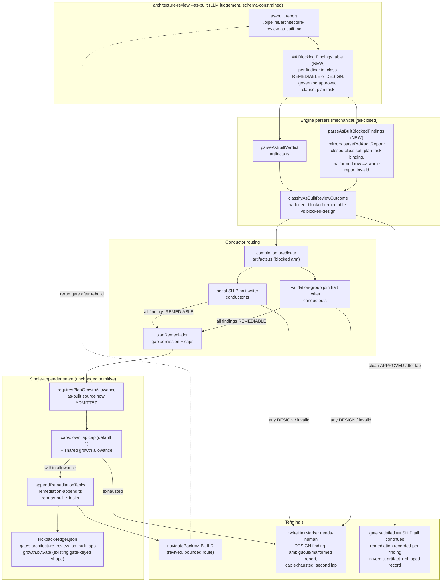

# Components: As-Built BLOCKED Per-Finding Classification and Bounded Remediation

**Last updated:** 2026-08-25
**Scope:** issue #1874 — classify each as-built BLOCKED finding (REMEDIABLE vs DESIGN) and
route REMEDIABLE findings through the existing single-appender remediation seam under a new
`architecture_review_as_built` gate key; DESIGN, ambiguity, and cap exhaustion all halt
`needs-human`.

## Diagram

## Legend

- **NEW** marks new machinery; everything else is existing seams reused.
- Classification is an LLM verdict constrained by a closed schema (repo design principle);
  all bookkeeping (parsing, caps, ledger, halt) is mechanical and fail-closed.
- One appender preserved: as-built findings enter through the same `planRemediation` →
  `appendRemediationTasks` seam prd_audit uses, under their own gate key — no second appender.
- Supersedes `adr-2026-08-22-as-built-review-runs-always-with-plan-gap` D3 (bounded revival of
  the as-built→build route) and amends `adr-2026-08-22-one-owner-per-review-question`'s
  appender clause.

## Change Log

| Date | Change | Reason |
|------|--------|--------|
| 2026-08-25 | Initial generation | DECIDE for issue #1874 |
