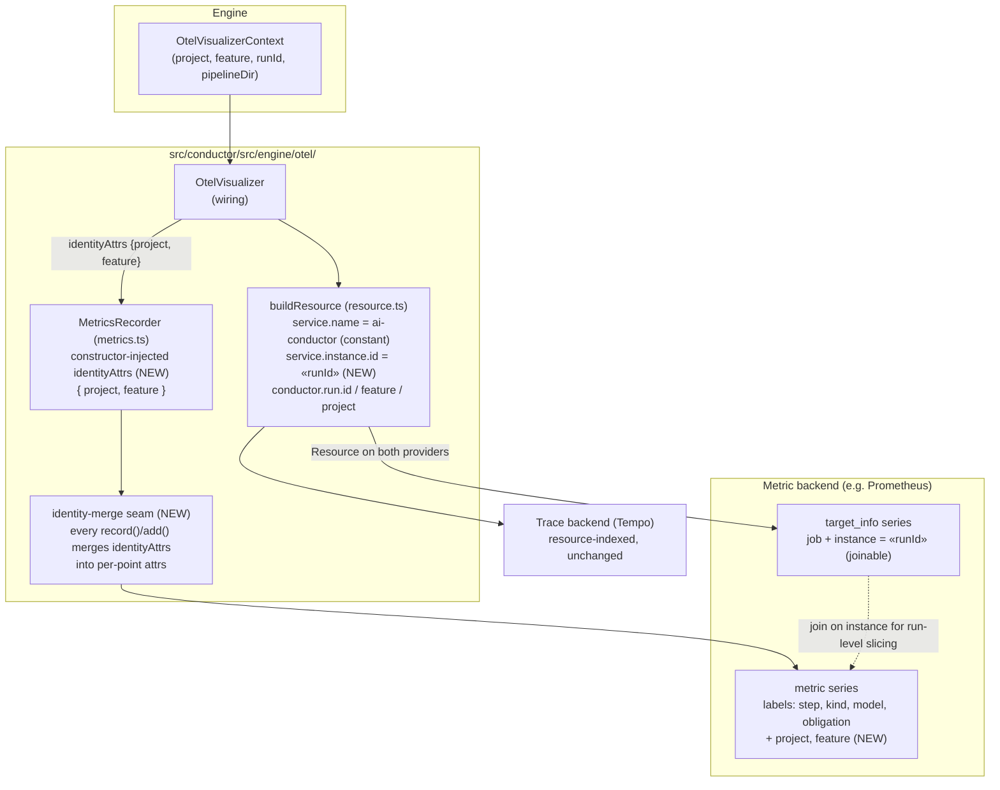

# Components: OTel two-layer identity (#1938)

**Last updated:** 2026-08-26
**Scope:** Identity propagation through `src/conductor/src/engine/otel/` — how project, feature,
and run id reach metric data points and the OTel Resource so metric backends can distinguish
projects and concurrent runs without collector rewriting.

## Diagram

## Identity contract (consumer-facing)

| Layer | Carrier | Values | Cardinality |
|-------|---------|--------|-------------|
| Service | `service.name` (resource) | constant `ai-conductor` | 1 |
| Instance | `service.instance.id` (resource) | run id (feature run) | 1 per run, resource-only |
| Dimensions | data-point attributes | `project`, `feature` | bounded (fleet size × features) |

- Cross-project totals: `sum(metric)` — no `by` clause needed; separation never forces per-project queries.
- Per-project/per-feature slicing: `by (project)` / `by (feature)` directly on data points.
- Run-level metric slicing (rare): join `target_info` on `instance`; run id never lands on data points, so series growth per metric stays bounded as runs accumulate.
- Traces: unchanged; run id on the resource ties a trace to the same run's `target_info`.

## Legend

- **(NEW)** — added by this feature; all other nodes exist today.
- The identity-merge seam is one code point inside `MetricsRecorder`, so instruments added
  concurrently (e.g. #1941's cost/dispatch counters) inherit `project`/`feature` automatically.

## Change Log

| Date | Change | Reason |
|------|--------|--------|
| 2026-08-26 | Initial generation | DECIDE for #1938 (two-layer OTel identity) |
