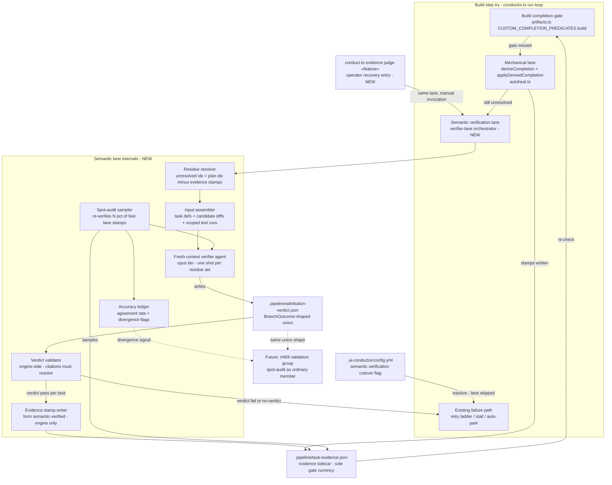
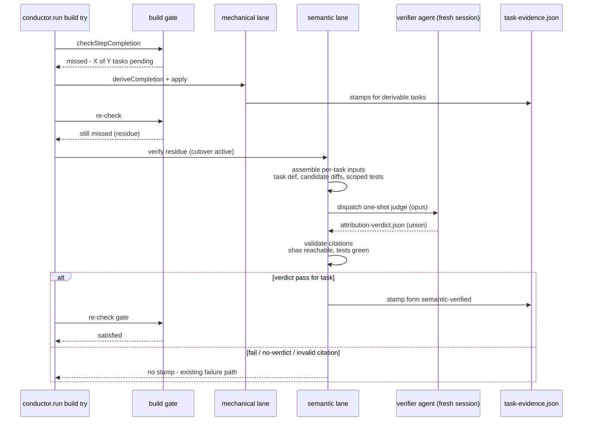

# Components: Semantic Attribution Verification (two-lane evidence gate)

**Last updated:** 2026-07-11
**Scope:** BUILD-gate attribution machinery — the existing mechanical lane and the new
semantic verification lane, their shared evidence sidecar, and the spot-audit accuracy
loop. Feature slug: `evidence-gate-validates-provenance-proxies-not-whe` (#520).

## Diagram

## Legend

- **Mechanical lane** — today's deterministic derivation: trailer grammar, path
  corroboration, `Evidence: satisfied-by` resolution. Unchanged; stays first and cheap.
- **Semantic verification lane (NEW)** — runs only when the mechanical lane leaves
  residue, config cutover is active, and the try would otherwise fail. The agent judges;
  the **engine** validates citations and writes stamps (agent never touches the sidecar).
- **BranchOutcome-shaped union** — `verdict (pass|fail|blocked)` / `no-verdict (reason)` /
  `skipped`, matching the #469/#500 group-core member interface so the spot-audit can
  later join the validation group without a new scheduler.
- **CLI recovery entry (NEW)** — `conduct-ts evidence judge «feature»` invokes the same
  lane (same input assembly, same citation validation, same engine-only stamping) so an
  operator can resolve an evidence halt without insider trailer knowledge (#467). No
  separate judgement path — one verifier, two invokers.
- **Split attribution** — one commit may satisfy several tasks (mono-dispatch bundling,
  #519/#520 shape 6): the verdict union is per-task, so multiple tasks may cite the same
  sha; the validator accepts overlapping citations. This is also the seam #474 concurrent
  streams will lean on.
- Dashed edges — future composition, not built by this feature.
- `«slug»` / `«feature»` placeholders denote variable parts.

## Sequence: residue verification on a failing build try

## Change Log

| Date | Change | Reason |
|------|--------|--------|
| 2026-07-11 | Initial feature diagram | DECIDE phase for intake #520 (semantic attribution verification) |
| 2026-07-11 | Added CLI recovery entry + split-attribution legend | Operator-approved design: engine-embedded verifier with `conduct-ts evidence judge` manual entry (#467); mono-dispatch split case made explicit |
