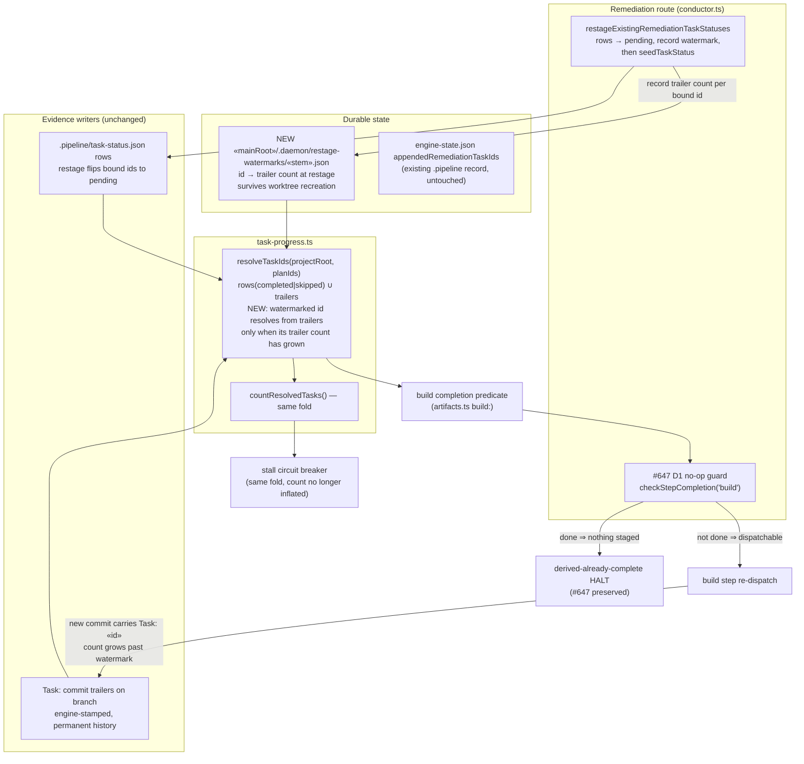
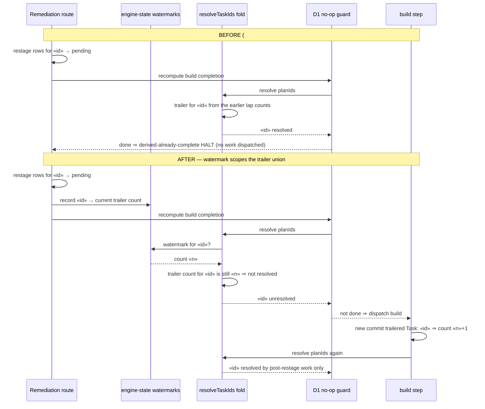

# Architecture — Restage watermark for existing-task remediation (#2196)

**Stem:** `existing-task-remediation-restage-is-undone-by-the` · Tier M (lightweight) · 2026-09-06 · Refs #2196

An existing-task remediation binds a finding to a plan task that was, by definition, already
built. `restageExistingRemediationTaskStatuses` (`conductor.ts`) writes that task's row back to
`pending`, but the shared resolution fold `resolveTaskIds` (`task-progress.ts`) unions rows with
every `Task:` trailer in the merge-base range — and the trailer from the earlier lap is permanent
branch history. The row is overridden, the build completion predicate reports done, and the #647
D1 no-op guard halts `derived-already-complete`.

The fix adds a **restage watermark**: for each reopened task id, the number of trailered commits
already carrying that id when the restage happened, stored at
`<mainRoot>/.daemon/restage-watermarks/<plan-stem>.json` — outside the worktree, so it survives
worktree recreation the way park markers do (adr-2026-07-10-park-marker-main-root-resolution). Within `resolveTaskIds`, a watermarked id
resolves from trailers only when that count has **grown** — a new trailered commit landed after the
restage. It is an integer comparison on the fold's existing per-id trailer scan: no sha, no
reachability, no attribution (adr-2026-07-23 Decision 4 stays intact), and a rebase that maps
commits 1:1 leaves the count unchanged. Rows keep their existing meaning — a `Done when:` close
that flips the row to `completed` resolves the task regardless of trailers — so no-diff and
verify-only closures are unaffected, and #859's false-stall fix is untouched.

## Component / dataflow

## Sequence — failure vs. target state

## Key architectural decisions

1. **Fix the shared fold, not one call site.** The D1 guard, the build completion predicate,
   and the stall circuit breaker all read `resolveTaskIds`. Scoping the trailer union there
   keeps them on one definition of complete; a guard-local row check would have let the build
   gate re-close the task from the same stale trailers with no new commit.
2. **Growth, not erasure — and no sha reasoning.** The watermark never deletes or rewrites
   trailer history; it records how many trailered commits an id already had and requires more.
   This keeps `resolveTaskIds` the plain trailer-id fold adr-2026-07-23 Decision 4 demands (no
   sha reachability, no pinned stamps, no attribution) and is rebase-proof. The watermark can
   only ever withhold a trailer resolution, never grant one (adr-2026-08-03 Decision 1 shape).
   Every non-watermarked task keeps the exact #859 behavior, including the fresh-build case
   whose rows were never flipped. A row flipped to `completed` by a `Done when:` close
   (`task-progress.ts` close contract) still resolves — no-diff/verify-only closures need no
   exemption because the watermark scopes the trailer branch only.
3. **The record outlives the worktree.** A recreated worktree rebuilds `task-status.json` from
   trailers, restoring every restaged task as `completed` (`task-seed.ts` reconstruction), so a
   worktree-resident watermark would vanish with no on-disk trace and the defect would silently
   return. The watermark therefore lives at the main repo root under `.daemon/`, resolved with the
   park-marker primitive `resolveMainRepoRoot` (`park-marker.ts`) and keyed by plan stem — the
   corpus's established carrier for per-feature state that must survive recreate
   (adr-2026-07-10-park-marker-main-root-resolution). `.daemon/` is excluded from the self-host
   live boundary, so the write is safe during self-host builds. Reconstruction itself reads the
   watermark too: a reopened id whose count has not grown is restored `pending`, never
   `completed`, so the fold's row branch cannot re-close it.
4. **Nothing fails open.** With the record outside the worktree there is no lost-watermark case
   to disarm; an absent file means no task was ever restaged for this feature. A present but
   unparseable file abstains loudly — the ids it might name stay unresolved and a diagnostic is
   emitted — never the more permissive reading (adr-2026-08-31 Decision 1 posture). The
   worktree-local `appendedRemediationTaskIds` guard keeps its own, separate fail-open.
5. **The D1 guard keeps its job.** A remediation round that genuinely stages nothing new
   records no watermark, resolves complete, and still halts `derived-already-complete`.
6. **The restage is observable on the spine.** The reopened ids and their counts ride the
   existing `kickback` event as an additive optional field, emitted at the restage seam, one
   emission per mutation (adr-2026-08-18 Decision 3 shape). No sidecar, no new channel.

## Touched modules

- `src/conductor/src/engine/conductor.ts` — `restageExistingRemediationTaskStatuses` records the
  watermark for each bound id before re-seeding
- new `src/conductor/src/engine/restage-watermark.ts` — read/record helpers for the main-root
  watermark file (atomic temp+rename write, tolerant read: absent → empty, corrupt → abstain with
  diagnostic), path resolved through `resolveMainRepoRoot` from `park-marker.ts`
- `src/conductor/src/engine/task-progress.ts` — `resolveTaskIds` applies the watermark count test
  to the trailer union; the trailer scan counts commits per id instead of flattening to a set
- `src/conductor/src/types/events.ts` — additive optional restage field on the `kickback` event
- `src/conductor/src/engine/task-seed.ts` — the reconstruction branch restores a watermarked id
  with an ungrown count as `pending`
