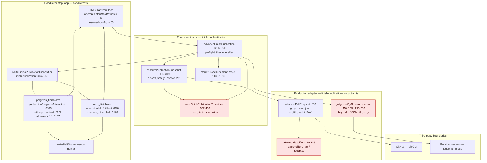
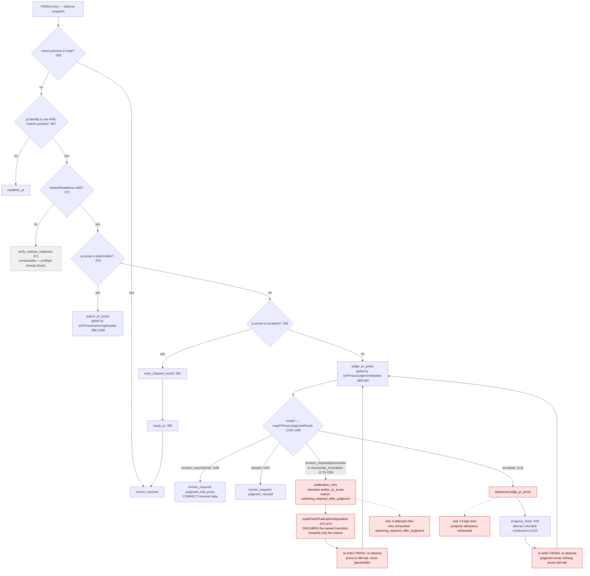
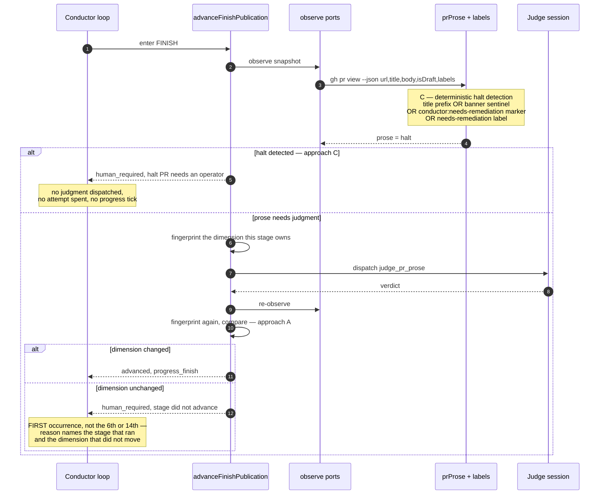

# Architecture: FINISH publication non-advancing retries

**Last updated:** 2026-08-13
**Scope:** The FINISH publication coordinator's observe → select → advance loop
(`src/conductor/src/engine/finish-publication.ts`, `finish-publication-production.ts`) and its
disposition routing in `src/conductor/src/engine/conductor.ts`. Covers the two non-convergent
cycles filed as jstoup111/ai-conductor#1487 and the target architecture under the
operator-confirmed approach (fixed-point guard + deterministic halt-PR short-circuit).
All line references are at worktree HEAD `92734d3e7`.

## Diagram: components (L3)

## Diagram: current selection and the two defect cycles

`prProse` classifies an auto-opened halt PR as `halt` from a `needs-remediation:` title prefix
or the `HALT_PR_BANNER_SENTINEL` in the body (`finish-publication-production.ts:125-128`).
`halt` is neither `placeholder` nor `accepted`, so the selector routes it to judgment forever:
nothing in the judgment path writes the PR, so the observation that selected the stage is
identical on the next pass.

**Why the laps are free.** `judgmentByRevision` is keyed on the PR's title/body revision
(`finish-publication-production.ts:154-155`, `:288-296`) and caches terminal verdicts, so an
unchanged revision re-returns the identical verdict with **no provider call**. That is why
attempts 2-6 in the filed evidence settled in about 1 ms with no `provider preparing` line —
the memo makes the loop cheap, not finite.

## Diagram: target — fixed-point guard and halt short-circuit

## Legend

- **Red nodes** — the current defect surface: the classifier value that has no consuming stage
  (`halt`), the memo that makes repeat laps free, and the routing arm that discards the named
  transition.
- **Grey node** — `verify_release_readiness`, selected only when `releaseReadiness !== 'valid'`,
  which preflight (`finish-publication.ts:886-915`) already blocks. It is unreachable as real
  work and its `PUBLICATION_RETRY_REASONS` entry is empty (`:527`).
- **Dimension** — the slice of `PublicationSnapshot` a transition is responsible for moving
  (`author_pr_prose` and `judge_pr_prose` both own `pr.prose`; `establish_pr` owns
  `pr.identity` and `branchPushed`; `write_shipped_record` owns `shippedRecord`; `ready_pr`
  owns `pr.ready`; `record_outcome` owns `outcomeRecord`). The guard compares only that slice,
  so unrelated churn elsewhere in the snapshot cannot mask a stalled stage.
- **Fingerprint** — a stable value derived from the owned dimension, compared before and after
  the effect. It is held for the duration of one `advanceFinishPublication` call; no
  cross-process state is introduced and no new ledger or sidecar file is written.

## Architectural notes

- The existing re-observation rule from `adr-2026-08-01-engine-owned-resumable-finish-publication`
  is **preserved**: the fresh observation remains the sole authority for stage selection. The
  guard adds a comparison over observations the coordinator already makes; it does not make a
  previously-returned transition authoritative.
- Approach C adds one field (`labels`) to an existing `gh pr view --json` call
  (`finish-publication-production.ts:233`). No new third-party boundary, no new port.
- `halt-pr-rehabilitation.ts:500-505` (`hasHaltSignal`) already implements the four-signal halt
  test (title prefix, label, banner, body marker). Approach C reuses that predicate rather than
  writing a second one; today it is unreachable from the coordinator because it runs inside
  `repairPresentation`, which is gated behind `ready_pr` and therefore behind prose already
  being `accepted`.
- No new telemetry channel: the guard's outcome travels on the existing
  `finish_publication_transition` / `finish_publication_disposition` events and the existing
  `loop_halt` reason string.

## Change Log

| Date | Change | Reason |
|------|--------|--------|
| 2026-08-13 | Initial generation | DECIDE for jstoup111/ai-conductor#1487 |
