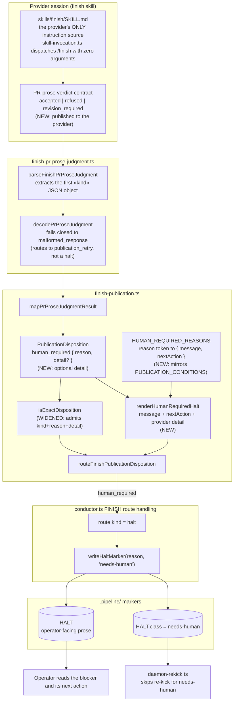
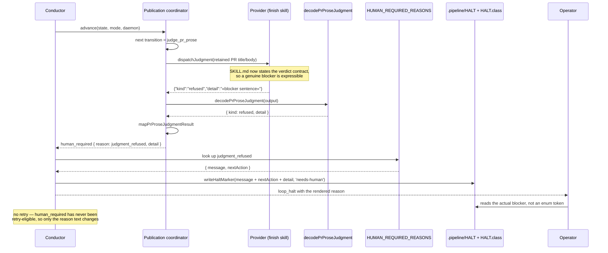

# Architecture: FINISH refusal reaches the operator with its reason

**Last updated:** 2026-08-08
**Scope:** The FINISH `judge_pr_prose` verdict path and the rendering of `human_required`
dispositions into the needs-human HALT. Covers the provider verdict contract in
`skills/finish/SKILL.md`, the `PublicationDisposition.human_required` arm in
`src/conductor/src/engine/finish-publication.ts`, and the conductor's halt-marker write.

## Component View

## Refusal Sequence

## Legend

- **NEW / WIDENED** annotations mark the surfaces this feature changes. Everything unannotated
  already exists and is unchanged.
- `«detail»` is guillemet placeholder notation for a provider-supplied blocker sentence.
- "needs-human" is the existing `HaltClass` from `halt-marker.ts`; `daemon-rekick.ts` already
  refuses to re-kick it. This feature does not change halt routing — only what the operator reads.

## Design Notes

**Why no new durable artifact.** The filer's hypothesis proposed a `.pipeline/finish-blocker.json`
carrying the refusal. It was rejected: `.pipeline/HALT` + `HALT.class` already carry both the prose
and the routing class, and a second artifact would need its own staleness and sweep semantics for a
machine-readable seam that nothing consumes today. See
`.memory/decisions/2026-08-08-finish-human-required-halt-reasons.md`.

**Why the guard has to move.** `isExactDisposition`'s `human_required` arm is an exact-key check
(`hasOnly('kind', 'reason')`). `detail` is therefore not additive-by-default — the guard, every
construction site, and the tests asserting the exact shape all change together. This is the single
largest reason the feature is tier M rather than S.

**Reachability, not just wording.** Today the `refused` verdict cannot be produced: the vocabulary
exists only in the engine and its tests, so a refusing provider writes prose, the parser finds no
JSON, and post-#1372 it fails closed to `malformed_response`, which routes to a judgment retry —
so the refusal is spent by the bounded progress allowance and the operator never sees it.
Publishing the contract in SKILL.md is what makes the refusal path live; the reason map is what
makes it legible.

## Change Log

| Date | Change | Reason |
|------|--------|--------|
| 2026-08-08 | Initial generation | DECIDE for intake jstoup111/ai-conductor#1107 |
