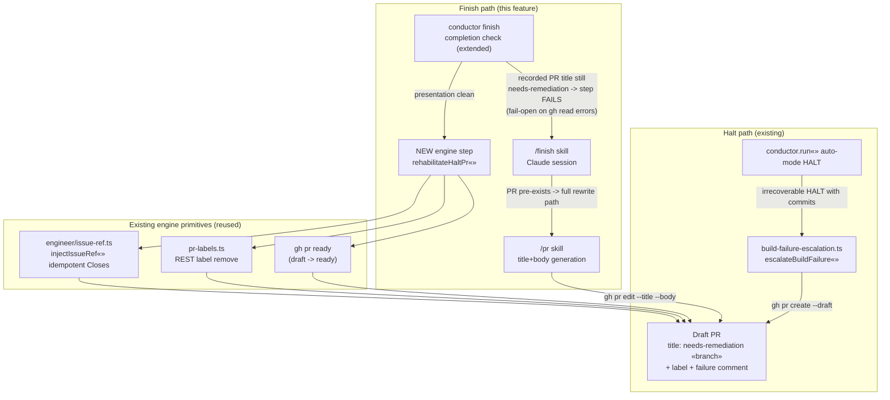

# Components: finish-time rehabilitation of reused needs-remediation halt PRs

**Last updated:** 2026-07-03
**Scope:** the finish/ship path components affected by issue #271 — halt-PR birth,
finish-time presentation rewrite (skill), deterministic rehabilitation mechanics
(engine), and the finish completion gate (conductor).

## Diagram

## Legend

- **Halt path** — unchanged; `escalateBuildFailure` is where a needs-remediation
  draft PR is born (`src/conductor/src/engine/build-failure-escalation.ts`).
- **Finish path** — the hybrid split (Approach C): the skill owns title/body
  *presentation*; the conductor's finish completion check makes that rewrite
  enforceable (retries drive compliance); the new engine step owns the
  deterministic *mechanics*.
- **Primitives** — no new gh plumbing: label clearing reuses the REST helpers in
  `pr-labels.ts` (Projects-classic-safe), Closes injection reuses
  `injectIssueRef` (idempotent — "present exactly once" comes free), ready-flip
  is a single `gh pr ready` call.
- `«»` marks variable parts of labels (function args, branch names).

## Change Log

| Date | Change | Reason |
|------|--------|--------|
| 2026-07-03 | Initial generation | DECIDE phase for issue #271 (engineer session) |
| 2026-07-03 | Gate edge: title-only failure, fail-open reads | Conflict-check Option 1 (draft alone ≠ halt signal, #199) |
