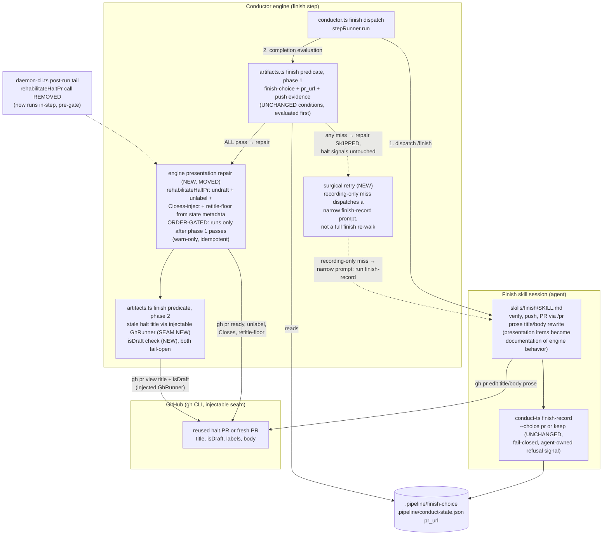

# Components: finish-step completion becomes engine machinery (issue #499)

**Last updated:** 2026-07-11
**Scope:** The finish-step completion seam — the NEW engine-performed presentation repair
inside the finish step, the hardened completion gate (injectable gh seam + draft check),
the surgical recording-only retry, and the unchanged agent-owned decision recording via
`finish-record`. Tier M, technical track. Approach B (split by facet): engine owns
presentation mechanics; the agent keeps the ship/keep decision.

## Diagram

## Legend

- **NEW** — surfaces added by this feature: the engine-performed order-gated
  presentation repair inside the finish step's completion evaluation, the retitle-floor
  derived from state metadata, the gate's `isDraft` check, the injectable `GhRunner`
  seam in the gate (replacing the hardcoded `makeProductionGh()` at the stale-title
  read), and the surgical recording-only retry.
- **MOVED / ORDER-GATED** — `rehabilitateHaltPr` mechanics relocate from the daemon
  post-run tail (which runs after `conductor.run()` and therefore after the gate has
  burned its tries) into the finish step's completion evaluation. The repair runs only
  after the non-presentation conditions (phase 1) all pass and strictly before the
  presentation conditions (phase 2) — so a refusing or failing attempt never clears the
  `needs-remediation` label, body marker, or draft state, preserving the redispatch arm
  and reconciliation-sweep signals (conflict-check 2026-07-11 resolution).
- **UNCHANGED** — `finish-record` stays agent-owned and fail-closed; the absent
  `finish-choice` marker remains the agent's refusal signal (adr-2026-07-07 preserved).
  Halt-PR birth (`build-failure-escalation.ts`, `ensureHaltPresentation`) and the
  reconciliation sweep are untouched.
- **Retitle-floor** — a deterministic, functional title derived from spec metadata that
  clears the `needs-remediation:` prefix; the skill's `/pr` prose rewrite remains the
  quality path and may overwrite it (amends adr-2026-07-03 Decision 1's split).
- Dashed edges are conditional/removed paths. `«»` marks variable label parts.

## Change Log

| Date | Change | Reason |
|------|--------|--------|
| 2026-07-11 | Initial generation | DECIDE phase for intake issue #499 (engineer flow) |
| 2026-07-11 | Repair order-gated after phase-1 conditions; pre-dispatch invocation removed | Conflict-check Finding 1 resolution (operator-approved) |
