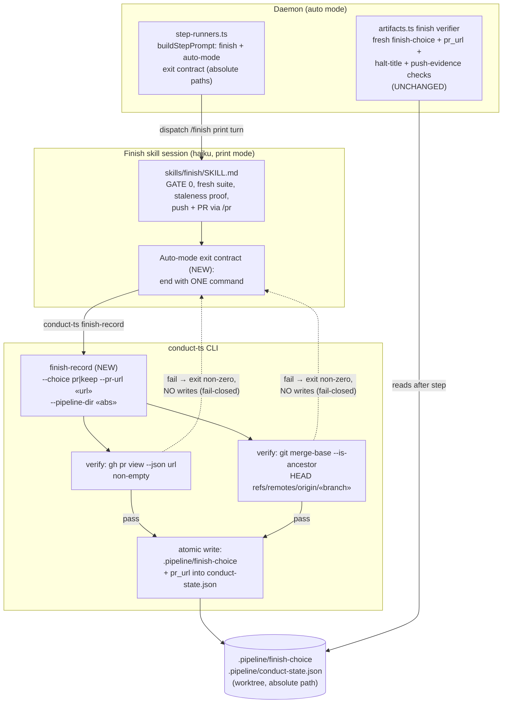

# Components: finish-record primitive — deterministic finish-choice marker write (issue #281)

**Last updated:** 2026-07-07
**Scope:** The finish-step completion seam in daemon auto mode — step dispatch, the finish
skill session, the new `conduct-ts finish-record` primitive, the completion markers, and
the finish completion gate. Tier M, technical track.

## Diagram

## Legend

- **NEW** — surfaces added by this feature: the `finish-record` subcommand and the
  SKILL.md auto-mode exit contract that invokes it.
- **UNCHANGED** — the completion gate in `artifacts.ts` keeps its exact semantics; the
  primitive satisfies the gate, it does not replace or weaken it. Push-evidence and
  halt-PR-rehabilitation checks in the gate still run independently.
- Dashed edges are failure paths: any verification failure (or gh/git error) exits
  non-zero and writes **nothing** — the missing marker remains the signal that finish
  did not complete, exactly as today (fail-closed).
- `keep` choice: verifications V1/V2 are skipped (no PR involved); only the
  `finish-choice` marker is written. `merge-local` / `discard` are rejected in daemon
  mode by the existing gate, so the primitive only accepts `pr` and `keep`.

## Change Log

| Date | Change | Reason |
|------|--------|--------|
| 2026-07-07 | Initial generation | DECIDE phase for issue #281 (engineer flow) |
