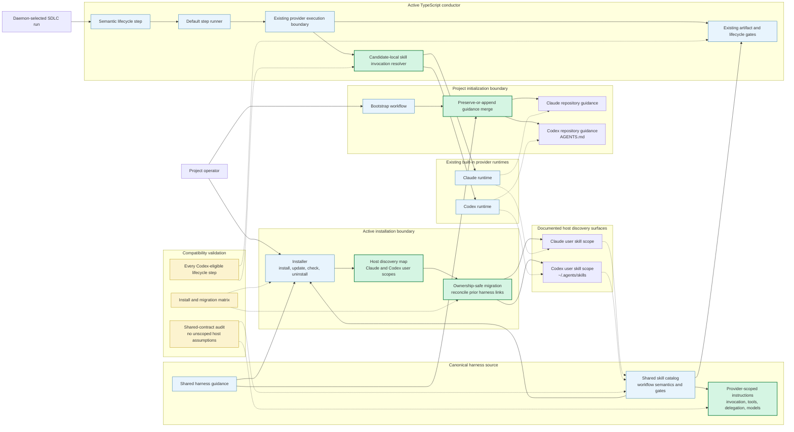

# Components: First-Class Codex Harness Parity (#904)

**Last updated:** 2026-07-25
**Scope:** Planned skill installation, repository guidance, shared workflow contracts,
provider-native daemon invocation, and completion gates for the built-in Claude and Codex
providers. Authentication and sandbox readiness (#905), usage reporting (#906), the legacy
bash conductor, and native interactive Codex session launching (#759) are excluded.

## Diagram

## Planned Boundaries and Invariants

- `skills/` remains the single canonical workflow source. #904 does not introduce a plugin
  package or generated provider-specific skill trees.
- The active installer maps that one catalog to each host's documented user discovery scope.
  Codex uses `~/.agents/skills`; the existing `~/.codex/skills` target is treated as a prior
  harness installation to reconcile without deleting user-owned content.
- Bootstrap preserves existing operator-authored guidance and adds only the missing harness
  reference. Codex guidance lives in `AGENTS.md`; Claude guidance remains independently valid.
- The conductor owns semantic lifecycle step names. Inside the existing candidate loop, a narrow
  invocation resolver translates only the explicit skill mention for the candidate about to run:
  `/skill-name` for Claude and `$skill-name` for Codex. A fallback candidate is resolved again, so
  provider syntax never crosses the fallback boundary. Routing, retries, model policy, and session
  isolation otherwise remain unchanged.
- Shared skills keep common workflow semantics, artifacts, and gates. Host-specific model,
  tool, delegation, and interactive behavior is explicitly scoped inside that shared source.
- An unavailable provider capability produces an explicit unsupported-capability outcome before
  incompatible instructions execute. It never silently borrows another provider's contract.
- Compatibility is enforced at three seams: installation/migration, shared-contract content,
  and the complete Codex-eligible daemon step matrix.

## Diagram Impact Boundary

#904 changes internal installation, initialization, instruction, and dispatch components. It
adds no external system, independently deployable container, database, table relationship,
message queue, cache, or new user-facing interface type. The system-context, container, and ERD
views therefore require no update. The existing provider-routing and provider-model-policy
diagrams remain authoritative below the invocation resolver boundary.

## Legend

- **Green nodes** are the planned #904 adaptation seams.
- **Blue nodes** are existing active components reused without architectural redesign.
- **Yellow nodes** are verification boundaries required to prevent drift or partial parity.
- **Solid arrows** are control flow or installed content flow.
- **Dotted arrows** are host discovery or validation relationships.
- The legacy `bin/conduct` path is deliberately absent because it receives no #904 work.

## Change Log

| Date | Change | Reason |
|------|--------|--------|
| 2026-07-25 | Moved skill invocation resolution inside the provider candidate loop | Fallback trace proved one pre-resolved prompt cannot be valid for both Codex and Claude candidates |
| 2026-07-25 | Initial planned component view | DECIDE architecture input for first-class, daemon-first Codex parity (#904) |
