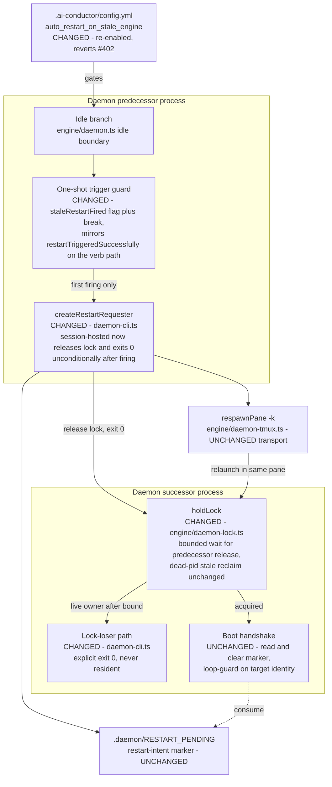

# Components: Single-generation stale-engine respawn (#400 fix)

**Last updated:** 2026-07-07
**Scope:** The components touched by the #400 hardening (Approach A — harden the existing
`RESTART_PENDING` stale-engine path in place; pipeline unification is follow-up #408).

## Diagram

## Legend

- **CHANGED** nodes are modified by this fix; **UNCHANGED** nodes are load-bearing context.
- Solid arrows: control flow. Dotted arrows: reads/writes.
- The two-pipeline structure (`RESTART_PENDING` underscore for stale-engine vs
  `RESTART-PENDING` hyphen for the restart verb) is retained by this fix; unifying them is
  follow-up jstoup111/ai-conductor#408.
- Invariant delivered: across a stale-engine transition, `pgrep -af "daemon --continuous"`
  for the repo counts exactly 1 at steady state.

## Change Log

| Date | Change | Reason |
|------|--------|--------|
| 2026-07-07 | Initial generation | DECIDE phase for issue jstoup111/ai-conductor#400 |
