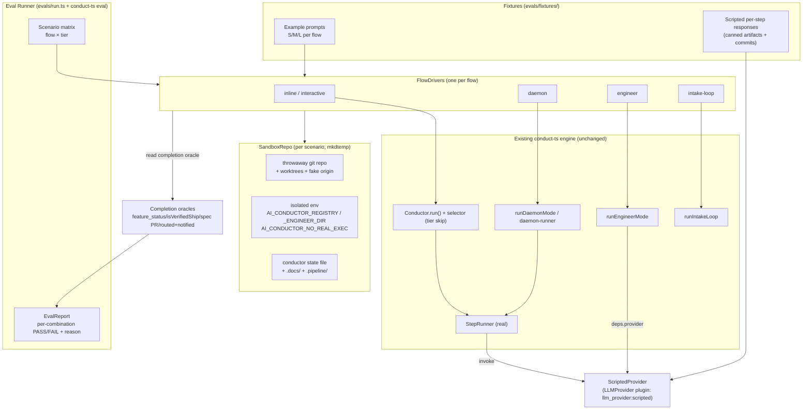

# Architecture: Flow-Level Eval Harness

**Date:** 2026-07-22
**Feature:** Runnable example scripts + eval for every conduct-ts flow at S/M/L prompts (#786)
**Tier:** L

## Overview

The eval harness drives each `conduct-ts` execution flow to its real completion checkpoint
inside a throwaway sandbox, using a **scripted `LLMProvider`** in place of the live `claude`
subprocess. The real orchestration (conductor gate loop, daemon drain, engineer DECIDE loop,
intake loop), the real tier step-skipping (`selector.ts`), and real `git`/worktree operations
run unchanged — only the LLM turn is replaced by canned, artifact-producing responses. This is
what lets it catch orchestration-level regressions (worktree exit-128, `no_task_progress`,
engineer land failure) that a pure `MockStepRunner` sequencing test cannot, while staying
deterministic and token-free.

## Container diagram (C4 L2)

## Key seams (all pre-existing injection points)

| Seam | File:symbol | Used by |
|---|---|---|
| Provider plugin registry | `src/conductor/src/engine/plugin-loader.ts` (`registry.register('llm_provider', 'claude', …)`) | Register `llm_provider:scripted` |
| Provider selection (inline) | `src/conductor/src/index.ts` (`registry.get('llm_provider', config?.llm_provider ?? 'claude')`) | Select scripted provider via config |
| Provider selection (daemon) | `src/conductor/src/daemon-cli.ts:746` | Same |
| StepRunner provider arg | `src/conductor/src/engine/step-runners.ts:310` | Real step logic over scripted provider |
| Engineer injected deps | `src/conductor/src/engine/engineer/loop.ts` (`deps.provider`, `deps.gh`, env registry) | Drive engineer loop |
| Sandbox recipe | `src/conductor/test/integration/daemon-ship.integration.test.ts` (`writeSpec`, `mkdtemp`+`git init`) | Reused/extracted into `SandboxRepo` |
| Tier skip | `src/conductor/src/engine/selector.ts` + `steps.ts` (`skippableForTiers`) | Tier scenarios exercise real skipping |

## Completion oracles (pass/fail signal per flow)

| Flow | Oracle |
|---|---|
| inline / interactive | `state.feature_status === 'complete'` + `feature_complete` event |
| daemon | `isVerifiedShip()` true + `.docs/shipped/<slug>.md` committed on impl branch (or a PR-open record) |
| engineer | spec PR opened for `spec/<slug>` (handoff result), or local-commit fallback recorded |
| intake-loop | idea routed + operator notified (status surface), zero claude spawns |

A scenario **fails** when the flow does not reach its oracle within a bounded budget, and the
runner captures the reason (wedge/park signal, non-zero git exit, missing artifact, HALT marker).

## Reachability note (for as-built §12)

New production surface introduced: the `llm_provider:scripted` plugin registration and a
`conduct-ts eval` subcommand + `npm run eval` script. Wiring targets are named in the
architecture-review `## Wiring Surface` section and derived onto plan tasks' `Wired-into:` lines.
