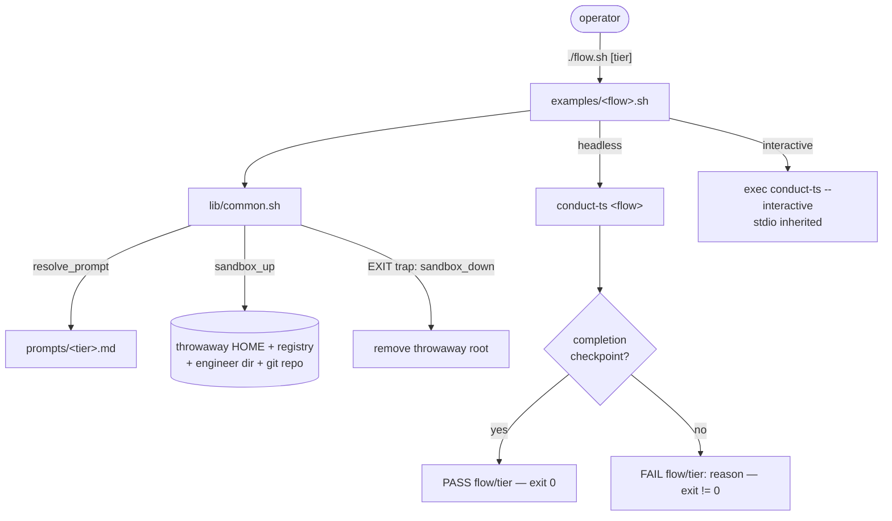

# Architecture: Runnable example scripts for every conduct-ts flow

Source: GitHub issue #786 (examples-only scope; eval split to #807).

## Goal

A committed `examples/` directory that lets an operator run any `conduct-ts` execution
flow end-to-end as a self-contained demo, at a chosen S/M/L prompt tier, without touching
their real registry / engineer store / daemon state / GitHub. Each flow has exactly one
script (the "scenario"); prompts are `.md` files referenced by the script or picked via a
TTY prompt.

## The five flows and their completion checkpoints (grounded in source)

| Flow | Example command | Headless? | Completion checkpoint |
|------|-----------------|-----------|-----------------------|
| inline | `conduct-ts inline "<prompt>" --auto` | yes | `feature_complete` + DONE marker (`conductor.ts:4933-4956`) |
| interactive | `conduct-ts inline "<prompt>" --interactive` | no (live REPL) | same DONE marker |
| daemon | `conduct-ts daemon` (drain once) | yes | per-feature DONE, then `pr_url` (`daemon-cli.ts:909,921`) |
| engineer | `engineer worktree → land → handoff` (primitives) | yes | `handoff` → `pr-opened` / `local-commit` (`engineer-cli.ts:914,891`) |
| intake-loop | `conduct-ts intake-loop --once` | yes | `intake-status.json` written (`intake-loop-cli.ts:139-155`) |

## Directory layout

```
examples/
  README.md                 # what each scenario demonstrates + its checkpoint + how to run
  lib/
    common.sh               # sandbox bootstrap, prompt/tier resolution, checkpoint assert, teardown
  prompts/
    small.md                # S-tier feature/idea prompt (self-contained)
    medium.md               # M-tier
    large.md                # L-tier
  inline.sh                 # headless self-asserting
  interactive.sh            # guided launcher (execs REPL)
  daemon.sh                 # headless self-asserting (seeds a fixture spec)
  engineer.sh               # headless self-asserting (seeds fixture .docs, runs primitives)
  intake-loop.sh            # headless self-asserting (seeds a fixture issue queue)
```

## Two example modes (see ADR: headless-vs-guided)

- **Headless self-asserting** (`inline.sh`, `daemon.sh`, `engineer.sh`, `intake-loop.sh`):
  resolve the tier prompt, run the flow to its checkpoint, then assert the checkpoint
  artifact exists and print `PASS <flow>/<tier>` (exit 0) or `FAIL <flow>/<tier>: <reason>`
  (exit non-zero).
- **Guided launcher** (`interactive.sh`, and the full-loop path of `engineer.sh` when run
  with `--interactive`): set up the sandbox, print the checkpoint the operator should watch
  for, then `exec` the real interactive command with stdio inherited. Not self-asserting —
  a human drives the REPL.

## Prompt + tier resolution (operator's design)

Each script sources `lib/common.sh#resolve_prompt`:

- `./inline.sh medium` → uses `examples/prompts/medium.md`.
- `./inline.sh` with a TTY → prompts `Which prompt? [s/m/l]` and reads the choice.
- `./inline.sh` without a TTY and no arg → error with usage (never silently picks one).

Prompts are plain `.md`; the script passes the file's text into the flow in that flow's
expected role (a *feature* for inline/daemon, an *idea* for engineer). `intake-loop` has no
free-text prompt — its "prompt" tier selects how many fixture issues are seeded.

## State isolation (see ADR: examples-state-isolation)

`lib/common.sh#sandbox_up` creates a throwaway working root and exports, for the duration
of the run:

- `HOME=<tmp>` — so repo-relative and `~`-relative state can't reach the real home.
- `AI_CONDUCTOR_REGISTRY=<tmp>/registry.json` (`registry.ts:89`).
- `AI_CONDUCTOR_ENGINEER_DIR=<tmp>/engineer` (`engineer-store.ts:181`).
- a throwaway `git init` repo as the flow's project root, so `.daemon/`, `.worktrees/`,
  `.pipeline/` all land under `<tmp>` and are removed on teardown.

GitHub-touching steps run against the sandbox store or with `--repo` pointed at a fixture;
no example opens a PR against the real remote. `sandbox_down` (an `EXIT` trap) removes the
throwaway root.



## Non-goals (this spec)

- No eval / regression runner aggregating flow×tier pass/fail (that is #807).
- No new TypeScript engine code; examples drive the existing CLIs only.
- No CI wiring (the eval issue #807 owns the CI regression story).
