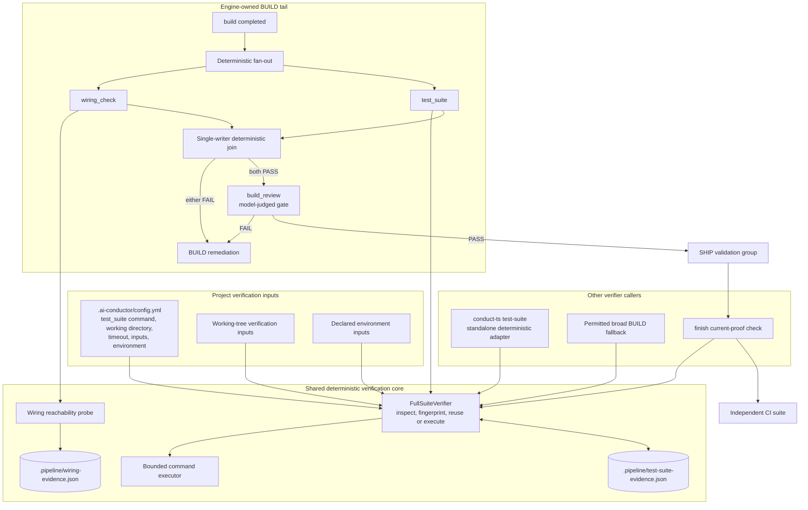

# Components: Deterministic full-suite verification gate

**Last updated:** 2026-07-29
**Scope:** Engine-owned aggregate verification, deterministic BUILD fan-out, proof reuse, and removal of the prompt-driven test-suite skill surface.

## Diagram



## Responsibilities and boundaries

- `test_suite` remains a built-in, non-disableable, engine-native BUILD gate. No model or skill invocation reads configuration, executes tests, decides freshness, or classifies the result.
- `wiring_check` and `test_suite` are independent read-only verifiers over the completed build. The engine starts both concurrently and joins their settled outcomes through one state writer.
- `build_review` starts only after both deterministic gates pass. A wiring or aggregate-test failure therefore spends no review tokens.
- The join fails closed. One failed branch blocks `build_review` and SHIP, records both settled outcomes, and routes the actionable deterministic failure back to BUILD.
- The configured aggregate suite is execution-only with respect to verification inputs: it may write ignored ephemeral outputs such as coverage data, but it does not modify fingerprinted project inputs or files consumed by the wiring probe.
- The SHIP validation group remains downstream of `build_review`; no SHIP validator begins before aggregate verification, wiring verification, and build review all pass.
- `FullSuiteVerifier` remains the sole owner of configuration resolution, content fingerprints, process execution, redaction, current-proof reuse, and test-suite evidence.
- The standalone `conduct-ts test-suite` command remains available as a deterministic adapter. The shipped `test-suite` skill and direct host-skill invocation are removed.
- Existing permitted broad BUILD fallbacks and `finish` use the same verifier and proof. CI remains independently authoritative.
- Engine-native steps do not require model-selection metadata. Removing the skill surface also removes misleading model/catalog registration while retaining step and gate documentation.

## Configuration shape

```yaml
test_suite:
  command: "npm test"
  working_directory: "src/conductor"
  timeout_seconds: 1800
  inputs:
    - "test-support/**"
  environment:
    - "CI"
    - "DATABASE_URL"
```

The project owns one authoritative aggregate command. Missing or invalid configuration, unresolved inputs, launch failure, timeout, and non-zero exit remain deterministic blocking outcomes.

## Legend

- Rounded processing nodes are engine operations; cylinder nodes are gitignored evidence sidecars.
- Concurrent execution is limited to the two deterministic BUILD gates. Model review and SHIP validation remain behind the join.

## Change Log

| Date | Change | Reason |
|------|--------|--------|
| 2026-07-25 | Initial generation | DECIDE phase for issue #940 |
| 2026-07-25 | Added completed-state resume verification and portable host verifier wording | Issue #940 plan and ADR amendment |
| 2026-07-29 | Removed the skill actor and added deterministic BUILD fan-out before build review | Deterministic test-suite step specification |
