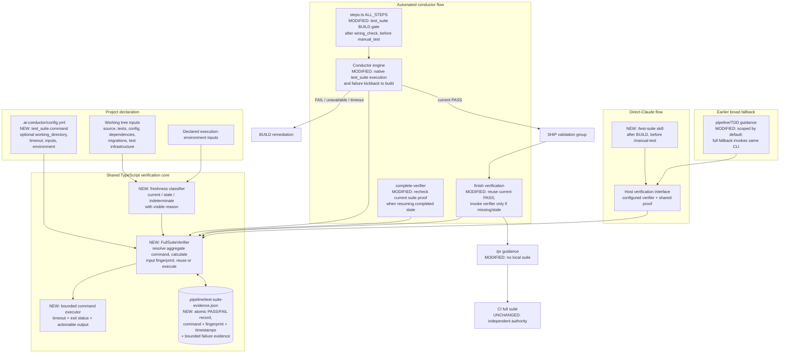

# Components: Full-suite verification gate (#940)

**Last updated:** 2026-07-25
**Scope:** One reusable, fail-closed full-suite proof shared by the TypeScript
conductor, direct-Claude workflow, earlier broad-test fallbacks, and finish.

## Diagram



## Responsibilities and boundaries

- `test_suite` is a built-in, non-disableable, mechanical BUILD gate. It runs
  after `wiring_check` and before `manual_test`, so a failure can use the
  existing gate loop to reopen `build` before any SHIP validator runs.
- The verification core, not an LLM step, owns command execution and proof
  creation. Direct Claude and any earlier full-suite fallback use the host's
  repository-configured verifier interface; all callers therefore make the
  same run-versus-reuse decision. The interface is not a repository-specific
  command and may use an internal adapter.
- A project declares one authoritative aggregate operation in
  `.ai-conductor/config.yml` under `test_suite.command`. The project—not the
  conductor—owns how that command composes unit, acceptance, and any other test
  categories. The block may also declare a working directory, timeout,
  additional input paths/globs, and environment variable names whose values
  affect verification.
- The input fingerprint covers the suite declaration, resolved executable,
  tracked and untracked non-documentation project inputs, declared additional
  inputs, and declared environment values. Documentation-only changes are
  excluded. Failure to enumerate, resolve, or hash a required input is
  `indeterminate`, which fails closed.
- Evidence is an atomic, gitignored sidecar. Only a successful aggregate result
  whose fingerprint equals the current fingerprint is reusable. A failure
  record is retained for routing and diagnosis but never satisfies the gate.
- `finish` calls the same verifier. In the normal flow it reuses the BUILD-gate
  proof; when invoked standalone or after a relevant mutation, it executes the
  suite and records a replacement proof.
- Completed-state resume checks call the verifier too, so persisted step
  completion cannot make stale suite evidence current.
- `/pr` performs no local suite execution. CI remains a separate run against
  the pushed revision and never trusts local evidence.
- Automated conflict resolution and CI repair retain their current
  post-mutation checks; they are outside this shared-proof optimization.

## Configuration shape

```yaml
test_suite:
  command: "npm test"
  working_directory: "src/conductor"
  timeout_seconds: 1800
  inputs:
    - "test-support/**"
  environment:
    - "CI"
    - "DATABASE_URL"
```

`command` is required and non-empty. Optional keys narrow no defaults:
`inputs` adds project-specific verification inputs, and `environment` names
values to include in the fingerprint. Missing configuration, an unresolved
command, an unreadable input, launch failure, timeout, or non-zero exit all
produce a blocking result with a visible reason.

For this repository, `npm test` resolves to `vitest run`, whose checked-in
configuration includes `test/**/*.test.ts`. That single project command already
contains ordinary unit/integration tests and `test/acceptance/**`; the conductor
does not need a second suite-composition DSL.

## Evidence contract

The sidecar is versioned and records at least:

- outcome (`PASS` or `FAIL`) and reason (`executed`, `reused`, `stale`,
  `missing_config`, `unlaunchable`, `timeout`, or `nonzero_exit`);
- exact resolved command, working directory, start/end times, duration, and
  exit code when available;
- current commit plus a content-derived `inputFingerprint` that also represents
  relevant dirty/untracked inputs;
- the declared environment variable names with values hashed, never stored in
  plaintext; and
- bounded stdout/stderr evidence that retains the beginning and end of output
  so test names and terminal errors remain actionable.

## Legend

- **NEW / MODIFIED** marks components changed by issue #940.
- The direct-Claude path is not a raw-command fallback: `/test-suite` uses the
  same configured verifier and proof contract through the host interface.
- The test runner's own internal caches are opaque. Reuse here means reusing a
  conductor proof for an identical verification fingerprint, not claiming how
  the underlying framework executed its tests.

## Change Log

| Date | Change | Reason |
|------|--------|--------|
| 2026-07-25 | Initial generation | DECIDE phase for issue #940 |
| 2026-07-25 | Added completed-state resume verification and bound the diagram to plan Tasks 10–20 | Plan-update architecture pass |
| 2026-07-25 | Replaced direct-command wording with the portable host verifier interface | ADR amendment for issue #940 |
