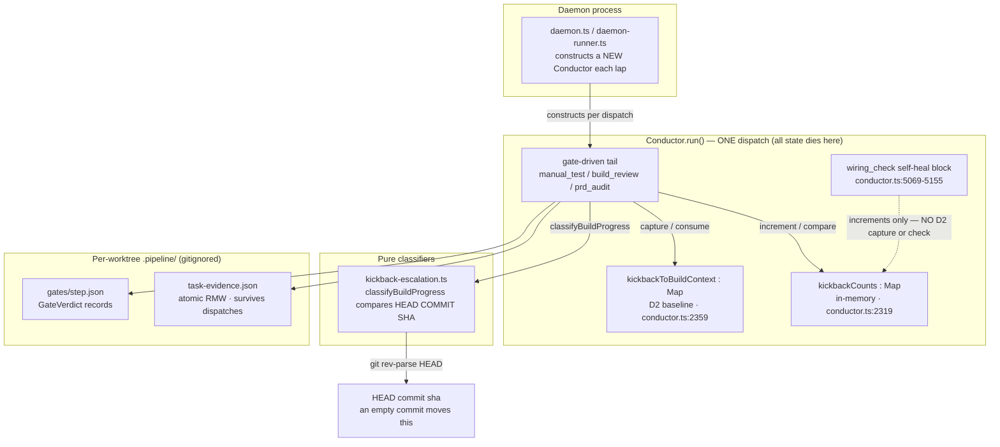
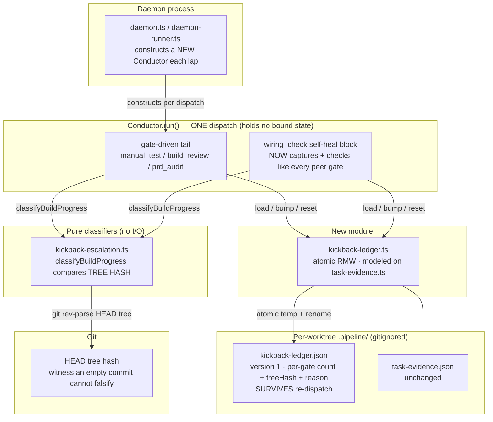

# Architecture: Cross-dispatch kickback livelock bound

Issue: jstoup111/ai-conductor#984
Tier: M
Track: technical

## Problem shape

The anti-ping-pong bound and the #647 D2 no-op escalation both live in memory inside
`Conductor.run()`. The daemon constructs a fresh `Conductor` per dispatch, so both reset at exactly
the boundary the observed livelock crosses.

## Current state (as-built)

**Three failure seams, all verified in source:**

1. `kickbackCounts` (`conductor.ts:2319`) and `kickbackToBuildContext` (`conductor.ts:2359`) are
   declared inside `run()`. Neither survives a re-dispatch, so the cap and the D2 baseline both
   restart at zero every lap.
2. `classifyBuildProgress` (`kickback-escalation.ts:35-41`) compares `headAfter !== headBefore`,
   sourced from `currentCommitSha` = `git rev-parse HEAD` (`project-prelude.ts:415`). An empty
   commit moves HEAD while leaving the tree byte-identical, so it is classified `did-work` and
   *suppresses* the very halt it should trigger.
3. The `wiring_check` self-heal block (`conductor.ts:5069-5155`) increments `kickbackCounts` but
   never calls `captureKickbackToBuildContext` / `checkKickbackToBuildEscalation`. It `continue`s
   at `:5134`, so it never reaches the generic D2 site at `:5411`.

## Target state

## Key structural decisions

**The ledger is a new `.pipeline/` module, not a field on an existing one.** `task-evidence.json`
has a shape guard requiring its three legacy keys (`task-evidence.ts:91-99`); grafting kickback
state onto it would couple two independent lifecycles. A separate `kickback-ledger.json` following
the same atomic temp-file + `rename(2)` pattern (`task-evidence.ts:130-164`) keeps them disjoint.

**There is already a cross-dispatch-durable counter to imitate.** `.pipeline/build-review-regrade.json`
(`build-review-disposition.ts:107`, read/written `:113-153`) is a counter that deliberately survives
re-dispatch and is reset only at the start of a genuinely fresh feature session —
`const isFreshFeatureSession = !state.run_started_at` (`conductor.ts:2166`), acted on at
`conductor.ts:2176-2180`. The kickback ledger adopts the same lifecycle: durable across dispatches,
cleared on a fresh feature session. This is the precedent that makes the change conventional rather
than novel.

**Only `kickbackCounts` and `kickbackToBuildContext` are migrated.** The same run-local defect
affects `stuckGate`, `prdAuditSelfHeals`, `remediationRounds`, and `manualTestSelfHeals`
(`conductor.ts:2330-2342`). Migrating all six at once would turn a bounded fix into a rewrite of
the tail's control flow. The two migrated here are the ones on the observed incident path; the rest
are recorded as follow-up scope, not silently left undocumented.

**The progress witness moves from commit sha to tree hash — and this is the opposite polarity
from ADR-2026-07-22.** That ADR rejected raw tree-hash equality for *preserving* a gate verdict,
because a foreign change would then re-run every gate and discard the benefit. Here the question is
inverted: we are deciding whether *any* progress occurred at all. Coarseness is the safe direction —
any real tree movement grants a fresh budget (fail-open), and only a byte-identical tree can consume
one. `GATE_SURFACE`/`partitionDelta` is deliberately **not** reused here: a build that touches only
`.docs/` is still not progress toward closing a wiring gap, and a surface-scoped delta would wrongly
grant a fresh budget for it. The two mechanisms answer different questions and correctly use
different keys.

**Scope of the persisted bound is one feature's worktree.** `.pipeline/` is gitignored and
per-worktree, so the ledger dies with the feature — no eviction policy, no TTL, no cross-feature
false positives. The known cost is the #497 class: deleting `.worktrees/<slug>` resets the bound.
That fails *open* (a fresh budget, never a spurious halt), which is the correct direction for a
guard whose failure mode is halting real work.

**The bound is keyed on the tree hash ALONE — never on failure-reason text.** This is the single
most important constraint, and it contradicts the issue's phrasing ("fails twice with the same
reason"). Only `wiring_check` produces a deterministic reason: its gap messages are engine-computed
in-process by the wiring probe. The other three kickback gates do not:

| Gate | Reason source | Stable? |
|---|---|---|
| `wiring_check` | engine-computed gap messages from `wiring-evidence.json` | Yes |
| `build_review` | `buildReviewFailureDetails` — LLM grader prose (`artifacts.ts:1115-1124`) | No |
| `manual_test` | `readManualTestFailRows` — agent-authored markdown rows (`artifacts.ts:715-740`) | No |
| `test_suite` | sanitized raw runner stderr/stdout, embeds durations and temp paths | No |

If the bound required reason equality, three of the four gates would essentially never match, the
counter would reset every lap, and the livelock this change exists to stop would survive the fix.
So: **tree hash unchanged → consume budget; tree hash moved → reset to a fresh budget.** The reason
text is recorded in the ledger for the HALT message only, never used as a comparison key.

**Nondeterministic steps keep their budget — via the budget, not via reason comparison.** A step
whose output legitimately varies over an identical tree still gets the full
`MAX_KICKBACKS_PER_GATE` laps before the bound trips, and any genuine tree movement restores a full
fresh budget. The limit therefore never collapses to zero, which is the issue's stated negative
path.

**The cap HALT must be classified `needs-human`.** The `build_review` and `wiring_check` cap HALTs
today are hand-rolled `writeFile` calls (`conductor.ts:5029-5036`, `:5137-5144`) that skip
`writeHaltMarker` and so write no `.pipeline/HALT.class` sidecar, leaving `readHaltClass`
`'unclassified'`. A livelock that has exhausted its budget is definitionally not
self-clearing, so these must route through `writeHaltMarker(..., 'needs-human')` and name both the
repeated gate and its recurring reason — that is the issue's "HALT names the gate and reason"
outcome, and it is what stops the re-kick sweep from silently recycling the loop.
