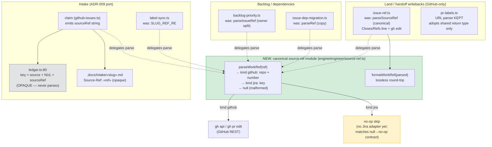

# Components: Canonical source-ref module (GitHub + Jira)

**Last updated:** 2026-07-22
**Scope:** The work-item reference (source-ref) flow through intake, ledger, land/handoff
writebacks, intake markers, and backlog dependency resolution — showing the new canonical
tagged-ref module as the single grammar owner replacing 5 divergent parsers.

## Diagram

## Legend

- **Green (SR):** the new canonical module — sole owner of both grammars
  (`owner/repo#N` with `#` always present; Jira `PROJ-123` never contains `#`, so
  the tagged parse is unambiguous).
- **Grey (LEDGER):** deliberately untouched — the dedup key treats the ref as an
  opaque string, so Jira keys already dedupe safely.
- **Yellow (NOOP):** GitHub-only writeback sites narrow on `kind === 'github'` and
  skip Jira refs non-fatally, exactly like today's null→no-op contract for
  malformed refs.
- **Dashed arrows:** parse delegation (the "was:" annotations name the divergent
  parser each site retires).
- `pr-labels.ts` parses **github.com URLs** (a different input domain) — it keeps
  its URL parse and only adopts the shared return type.

## Change Log

| Date | Change | Reason |
|------|--------|--------|
| 2026-07-22 | Initial generation | DECIDE phase for intake jstoup111/ai-conductor#847 (refs #774) |
