# Components: Generated HARNESS.md Model-Selection Table

**Last updated:** 2026-07-03
**Scope:** Feature-scoped L3 view — the single-source model-policy metadata in the engine, the
tsx table generator, and the integrity-suite drift/pin checks. Existing resolution machinery
(`resolveStepConfig`) is unchanged.

## Diagram

```mermaid
graph TD
    subgraph engine["src/conductor/src/engine (typed source of truth)"]
        RC["resolved-config.ts<br/>DEFAULT_STEP_MODELS<br/>DEFAULT_STEP_EFFORT<br/>DEFAULT_STEP_TIER_OVERRIDES"]
        META["model-table-metadata.ts (new)<br/>STEP_RATIONALE per StepName<br/>EXTRA_MODEL_TABLE_ROWS<br/>SKILL_STEP_MAP + PIN_EXEMPTIONS"]
    end

    subgraph tools["Generator"]
        GEN["src/conductor/src/tools/generate-model-table.ts (new)<br/>renders markdown table rows"]
        BIN["bin/generate-model-table (new)<br/>bash wrapper — runs tsx from source, never builds dist<br/>modes: write and check"]
    end

    subgraph artifacts["Committed artifacts"]
        HMD["HARNESS.md<br/>Model Selection table between<br/>BEGIN and END generated markers"]
        SKILLS["skills/«name»/SKILL.md<br/>hand-authored model pins"]
    end

    subgraph suite["Integrity suite (bash)"]
        CHK5["check 5a: table content drift<br/>bin/generate-model-table check-mode"]
        CHK5B["check 5b: SKILL.md pin vs engine default"]
        DEGRADE["degradation guard:<br/>node_modules absent → warn + skip"]
    end

    RC --> GEN
    META --> GEN
    GEN --> BIN
    BIN -- "write mode: rewrite marked region" --> HMD
    CHK5 -- "invokes check mode" --> BIN
    BIN -- "diff generated vs committed" --> HMD
    CHK5B -- "reads pins" --> SKILLS
    CHK5B -- "reads engine defaults via generator JSON output" --> BIN
    DEGRADE -.-> CHK5
    DEGRADE -.-> CHK5B
```

## Legend

- **engine** — TypeScript package; `META` is new typed metadata compiled against `StepName`,
  so adding a step without rationale fails `tsc`, not a human review.
- **Generator** — `GEN` is pure (data in → markdown out); `BIN` is the only entry point the
  suite and humans use. It executes via `npx tsx` from source specifically to avoid the
  shared-dist rebuild hazard (rebuilding `dist/` can crash running daemons in other repos).
- **suite** — extends existing check 5 (presence-only) with content drift (5a) and pin
  agreement (5b). When `src/conductor/node_modules` is missing both degrade to a warning,
  never a false failure.
- Solid arrows = data/control flow; dotted = conditional bypass.

## Change Log

| Date | Change | Reason |
|------|--------|--------|
| 2026-07-03 | Initial generation | DECIDE phase for intake jstoup111/ai-conductor#187 |
