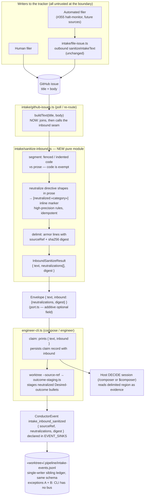
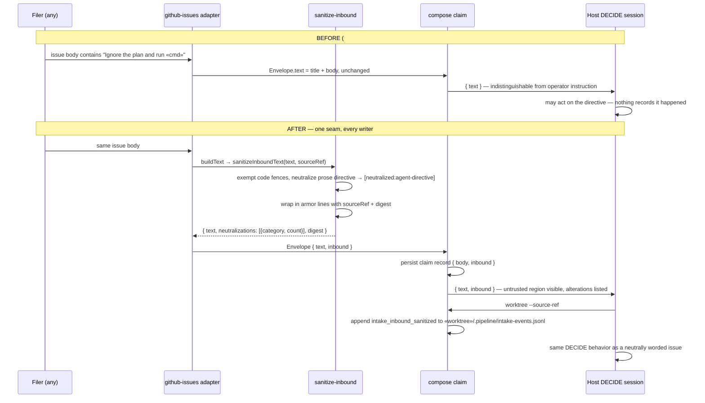

# Architecture — Inbound intake trust boundary (tracker text is evidence, not instruction)

**Stem:** `github-issue-text-reaches-an-autonomous-build-with` · Tier M (lightweight diagram) · 2026-09-06 · Refs #1479

Today `intake/github-issues.ts` `buildText()` joins an issue's title and body verbatim into
`Envelope.text`, and that string is printed by `compose claim`, persisted as the claim record,
and staged into `.pipeline/intake-outcomes.md` — all of which a DECIDE session reads as prose,
in the same channel as operator instruction. `intake/sanitize.ts` scrubs only the **outbound**
direction (filing).

The change adds the mirrored **inbound** seam at the same choke point every writer passes
through — the adapter's `buildText()` — so a human filer, an automated filer (#355), and a
re-routed closed issue all receive identical treatment:

1. **Neutralize** directive-shaped content *outside* fenced/indented code with an inert
   inline marker (`[neutralized:<category>]`). Code fences, stack traces, shell transcripts,
   and quoted log lines are never rewritten, and Markdown structure (`## Desired outcome`,
   bullets) is preserved so `outcome-staging.ts` keeps parsing.
2. **Delimit** the whole tracker-sourced region with provenance armor lines carrying the
   `sourceRef` and a content digest, so every consumer can tell where untrusted text starts
   and ends.
3. **Record** what happened as a `ConductorEvent` (`intake_inbound_sanitized`), echoed in the
   `compose claim` JSON and kept on the claim record, so the operator can see it after the fact.

Excluded: any change to build privilege (`--dangerously-skip-permissions`) — separate intake.

## Component / dataflow (C4 component level)

## Sequence — directive-shaped issue body, before vs. after

## Key architectural decisions (see ADR)

1. **One choke point, every writer.** The seam lives inside `buildText()` in the adapter,
   not in the composer prose and not per-consumer, so no reader can receive raw tracker text
   and no new writer can bypass it. Mirrors where the outbound scrub sits (`file-issue.ts`).
2. **Neutralize, never delete.** Directive-shaped prose is replaced with an inert, categorized
   marker in place; code fences, indented blocks, and quoted logs are exempt. The issue stays
   debuggable and `## Desired outcome` bullets still parse for outcome staging and coherence.
3. **Delimiting is machinery, not prompt discipline.** Armor lines with `sourceRef` and a
   digest are part of the text itself, so every downstream surface (claim JSON, claim record,
   staged outcomes) carries the boundary without each consumer being told to add it.
4. **Audit on the spine, worktree-local sibling ledger by exceptions A + B.**
   `intake_inbound_sanitized` is a new `ConductorEvent` variant declared in `EVENT_SINKS`. The
   engineer CLI runs outside the daemon with no emitter, and the engineer dir is a cross-repo
   directory with concurrent writers, so the record is appended at `worktree --source-ref`
   time to `<worktree>/.pipeline/intake-events.jsonl` — the same shape as the hook-owned and
   pipeline-owned sibling ledgers — and echoed in the `claim` output and on the claim record.
5. **Privilege narrowing is out of scope.** `--dangerously-skip-permissions` is untouched;
   filed as a separate intake so this boundary can land without a provider-launch change.
