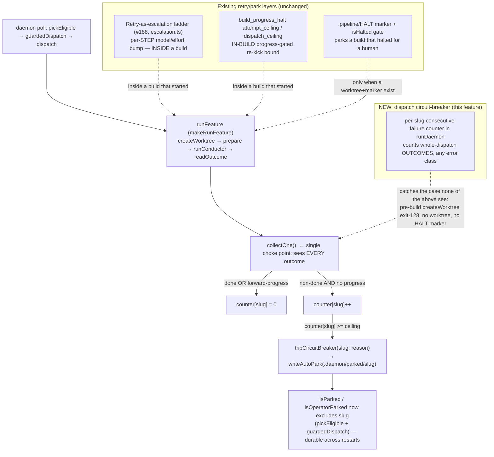

# Architecture: Global dispatch circuit-breaker

## Where the breaker lives

The breaker is a bound on the **outer dispatch loop** in
`src/conductor/src/engine/daemon.ts` (`runDaemon`). It is the outermost,
**error-class-agnostic** layer — it counts *dispatch outcomes*, not error types.

## The single choke point

`collectOne()` (`daemon.ts`, ~line 711) is the one place in `runDaemon` that
observes the resolved `{ slug, outcome }` for **every** dispatch — `done`,
`halted`, and `error` (including a thrown `runFeature` caught in `dispatch`).
Counting here (rather than at the many marker-write sites inside the conductor)
mirrors the precedent set by `onHaltWritten` (daemon.ts comment: *"the ONE choke
point that sees every halt path … causality is recorded here"*).

## Data flow of the counter

- **State:** `const consecutiveFailures = new Map<string, number>()` local to
  `runDaemon` (in-memory, per run — same lifetime discipline as `parked`,
  `started`, `progressReKickCounts`).
- **Increment:** in `collectOne`, when `outcome.status !== 'done'` **and** the
  dispatch made **no forward progress** (see below), `consecutiveFailures.set(slug, prev+1)`.
- **Reset:** on `outcome.status === 'done'` **or** forward progress, delete the
  slug's entry (reset to 0).
- **Trip:** when the incremented value `>= ceiling`, call the injected
  `tripCircuitBreaker?.(slug, reason)` dep exactly once, then leave the entry at
  the ceiling so it does not re-trip/re-write on subsequent (now-gated) polls.

## Forward-progress signal (anti-false-trip)

"Forward progress" reuses the **same signal the existing progress-gated re-kick
uses** — the resolved-task count stamped to the `TaskEvidence` sidecar
(`isProgressReKickEligible` in daemon-cli.ts already reads it). The breaker's
progress check is injected as an optional dep
`madeForwardProgress?(slug): Promise<boolean>` so the pure core stays git-free
and unit-testable. A dispatch that advanced the resolved-task count resets the
counter — a legitimately-recovering-but-slow attach therefore **never trips**.

A pre-build `createWorktree` failure produces no worktree and no progress, so it
always counts as no-progress → increments → trips at the ceiling. This is the
exact #714 failure it must catch.

## The trip action (reuse, do not invent)

`tripCircuitBreaker` is wired in `daemon-cli.ts` to
`writeAutoPark(projectRoot, slug, reason)` (`park-marker.ts`) — the existing
machine-provenance park (`auto-parked: <reason>`). Consequences, all via
existing machinery:

- `pickEligible`'s `isParked` guard and `guardedDispatch` immediately exclude the
  slug (no code change to those gates).
- The marker is **durable** (`.daemon/parked/<slug>` at the main root) → survives
  daemon restart, closing the "spin forever, even across restarts" hole.
- The startup dashboard already renders auto-parks with their extracted reason
  (`getProvenanceType === 'auto'`, daemon-cli.ts ~line 1306) → operator sees WHY.
- Recovery is an explicit operator un-park (`removeOperatorPark` / existing
  un-park CLI). A base-advance `rekickSweep` does **not** clear it (it skips
  `isOperatorParked` slugs) — correct, because a deterministic dispatch failure
  is not fixed by an unrelated base advance.

## Composition summary (no duplication)

| Layer | Scope | Fires when | Relationship to breaker |
| --- | --- | --- | --- |
| Escalation ladder (#188) | one step, one build | a step retries | Independent; inside a build the breaker never sees. |
| `build_progress_halt` | one build's re-kicks | in-build no/low progress | If it parks first, breaker is moot (slug already parked). |
| `progressReKickDispatchCeiling` | in-build progress re-kicks | 20 progress re-kicks | Bounds a *progressing* feature; breaker bounds a *non-progressing* one. |
| **Dispatch circuit-breaker (new)** | whole dispatch, any class | N consecutive no-progress outcomes | Outermost catch-all; the only one that sees pre-build failures. |

## Config

New `circuit_breaker` block in `config.ts`, mirroring `build_progress_halt`:

- `circuit_breaker.enabled` (boolean, default `true`)
- `circuit_breaker.consecutive_failure_ceiling` (positive integer, default `5`)

Validated (`validateCircuitBreakerBlock`) and resolved
(`resolveCircuitBreakerBlock`) with a `CIRCUIT_BREAKER_DEFAULTS` const, exactly
as `build_progress_halt` is. The resolved ceiling is threaded into `runDaemon`
via a new `DaemonDeps`/options field (mirrors `progressReKickDispatchCeiling`).
