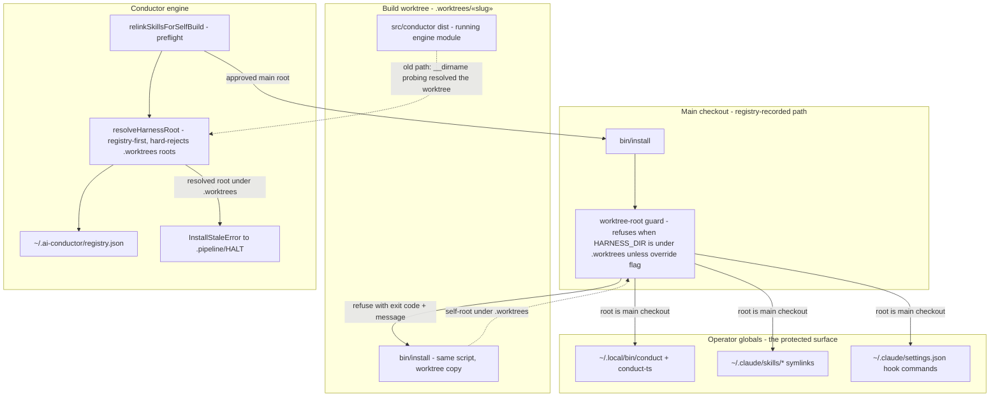

# Components: Worktree-rooted global-install guards (#363)

**Last updated:** 2026-07-06
**Scope:** The two guard points that stop a build-worktree checkout from repointing
operator globals — the `bin/install` self-root refusal and the registry-first,
worktree-rejecting harness-root resolution used by the self-build relink preflight.

## Diagram

## Legend

- **Solid arrows** — the healthy post-fix flow: preflight resolves the registry-recorded
  main checkout and only that root's installer may touch operator globals.
- **Dotted arrows** — the incident paths from #363, now terminated at a guard: a worktree
  copy of `bin/install` refuses to link globals from its own root, and a worktree-resolved
  harness root fails the preflight loudly instead of relinking.
- Guillemets `«slug»` mark variable path segments.

## Change Log

| Date | Change | Reason |
|------|--------|--------|
| 2026-07-06 | Initial generation | Spec for #363 worktree-install guards |
