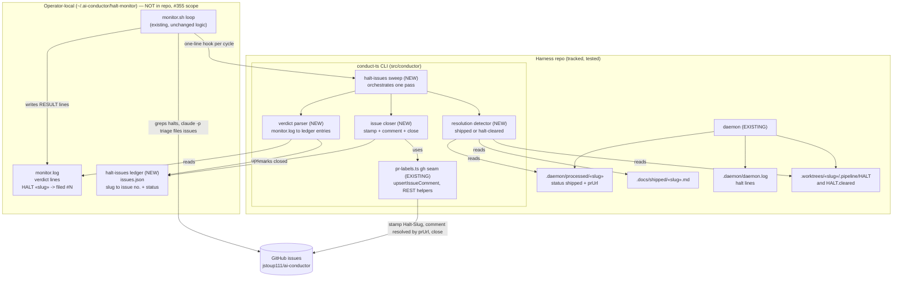

# Components: halt-monitor issue auto-close (deterministic ledger + closure sweep)

**Last updated:** 2026-07-08
**Scope:** The new `conduct-ts halt-issues sweep` subcommand and its place between the
operator-local halt-monitor, the daemon's ship/halt state, and GitHub issues. Monitor
migration/productization is out of scope (issue #355); the monitor gains only a
one-line per-cycle hook.

## Diagram

## Legend

- **NEW** — modules this feature adds; all inside `src/conductor` except the ledger
  file, which lives beside the monitor's existing state in
  `~/.ai-conductor/halt-monitor/`.
- **EXISTING** — untouched components the sweep reads or reuses.
- `«slug»` — placeholder for a feature slug.
- The monitor's own filing path (top edge) is unchanged: its headless triage still
  files/cites issues; the sweep runs after, deterministically, and never files.

## Change Log

| Date | Change | Reason |
|------|--------|--------|
| 2026-07-08 | Initial generation | DECIDE phase for issue #390 (auto-close sweep) |
