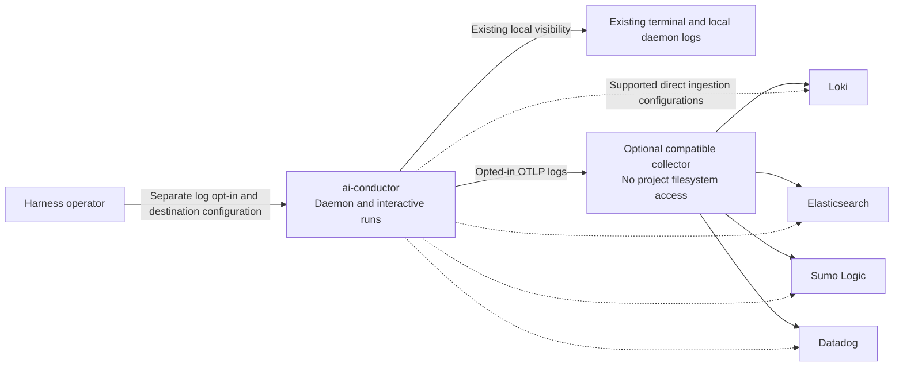

# System Context: Configurable harness log export

**Last updated:** 2026-09-30
**Status:** Approved by operator in composer chat, 2026-09-30
**Scope:** Operator configuration, harness execution modes, local visibility, and external log destinations.

## Diagram

## Legend

- Solid destination paths permit an operator-managed collector; it receives pushed records and does not read project files.
- Dashed paths indicate direct ingestion where the documented backend deployment supports it. Exact endpoint and authentication recipes are an architecture-review deliverable; the diagram does not promise every backend version accepts direct delivery.
- The collector is optional external infrastructure, not a process the harness starts or installs. The existing CLI/daemon process is the only harness runtime container involved; there is no new server or database and no ERD change.
- The two execution modes share log-export behavior. Separate mode-specific renderers may continue presenting local output.
- Nothing is sent without explicit log opt-in, including when existing trace and metric export is enabled.

## Requirement Coverage

PRD FR-1, FR-2, FR-3, FR-6, and FR-7. The four requested destinations are alternative deployment configurations, not a requirement for four simultaneous in-process exporters.

## Change Log

| Date | Change | Reason |
| --- | --- | --- |
| 2026-09-30 | Initial proposal | DECIDE for #1935 after operator approval of the PRD |
