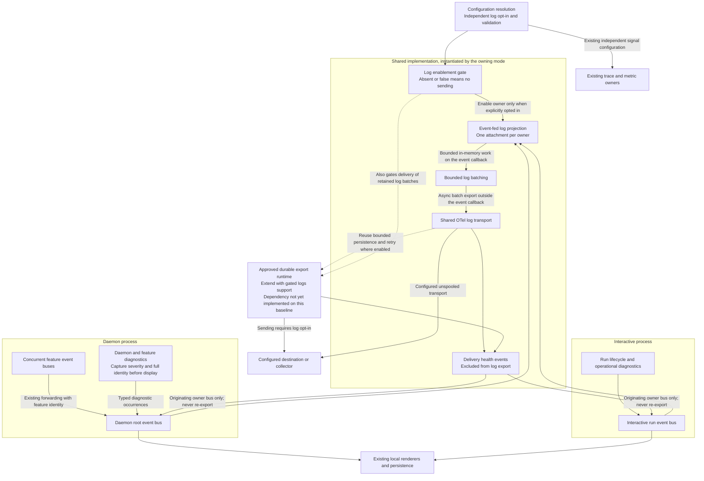

# Components: Shared, opt-in harness log export

**Last updated:** 2026-09-30
**Status:** Approved by operator in composer chat, 2026-09-30
**Scope:** Proposed log ownership and data flow within the existing conductor process. This is a feature-scoped diagram; it does not replace historical diagrams for traces and metrics.

## Diagram

## Legend and Ownership

- This diagram shows a proposed extension, not a claim that log export already exists. Both mode boxes use the same shared implementation; they represent separate invocations/processes, not two owners attached to the same event.
- In daemon mode the log listener subscribes only to the root bus. It receives forwarded feature events and daemon-origin occurrences once. Existing per-feature trace providers do not also own log export.
- In interactive mode the same listener and projection attach to the run bus. Completion detaches that run's subscriptions; a daemon feature completing never shuts down the daemon's log owner.
- Full project/feature attribution is captured from source context, including existing forwarding metadata, before any display truncation. Repository-wide records explicitly lack feature ownership. No latest-active-feature global variable or rendered-text parser is used.
- Missing operational diagnostics become typed occurrences on the existing event spine. Existing event renderers must not emit a second diagnostic occurrence for text they render from an event. Local terminal/file behavior remains covered independently of whether the remote listener exists.
- The independent enablement gate prevents creation of a sending log owner while off and also prevents transmission of retained log batches. It does not disable traces or metrics.
- Delivery-health occurrences return to the originating bus for local warning/persistence but are excluded from log projection and diagnostic recapture, preventing a feedback loop.
- Solid lines are proposed active flow; the dashed spool edge names an approved dependency whose implementation is absent on the checked-out baseline. It must be integrated rather than copied. Logs-only opt-in and retained-batch rules require an additive architecture decision before BUILD.
- Batching and asynchronous export keep destination and persistence I/O off the event callback. Exact queue, record-size, warning, and shutdown limits remain for architecture review.

## Verified Local Basis

- Shared mode wiring: `buildInteractiveVisualizers` in `src/conductor/src/index.ts` and `wireDaemonOtel` / `wireInteractiveOtelMetrics` in `src/conductor/src/engine/otel/wire.ts`.
- Shared event projection precedent: `MetricsListener` in `src/conductor/src/engine/otel/metrics-listener.ts`. Preserve single-owner registration and event-derived attribution; log projection may have its own sink selection and severity rules.
- Forwarding identity: `ForwardingEventEmitter` and `forwardedFeatureOf` in `src/conductor/src/engine/event-persister.ts`.
- Diagnostic/display boundaries: `createDaemonModeLogger`, `createFeatureDaemonLogger`, and `withDaemonLogFeatureOwnership` in `src/conductor/src/engine/daemon-log.ts`, plus the warning/error tee in `src/conductor/src/daemon-cli.ts`.
- Governing architecture: [ADR-014](../decisions/adr-014-otel-observability-exporter.md), especially non-blocking listeners, failure isolation, daemon event forwarding, and durable transport decisions 15–17.

## Requirement Coverage

PRD FR-1 through FR-11. Exact configuration syntax, the event/diagnostic coverage inventory, startup and teardown ordering, and concrete delivery limits are resolved in architecture review after diagram validation. No new internal event store or parallel logging schema is introduced.

## Related Diagrams and Validation

- [System context](harness-logs-have-no-export-path-daemon-log-is-a-f-context.md)
- [Enabled delivery and concurrent attribution](sequences/harness-logs-have-no-export-path-daemon-log-is-a-f-enabled.md)
- [Separate opt-in and invalid configuration](sequences/harness-logs-have-no-export-path-daemon-log-is-a-f-disabled.md)
- [Delivery failure and shutdown](sequences/harness-logs-have-no-export-path-daemon-log-is-a-f-failure.md)

All five Mermaid blocks passed the harness browser-based render check on 2026-09-30. Local document links were checked. The operator approved the proposed structure in composer chat on 2026-09-30. This diagram approval does not substitute for the subsequent architecture-review verdict and approval of concrete architectural decisions.

## Change Log

| Date | Change | Reason |
| --- | --- | --- |
| 2026-09-30 | Initial proposal | DECIDE for #1935 after operator approval of the PRD |
