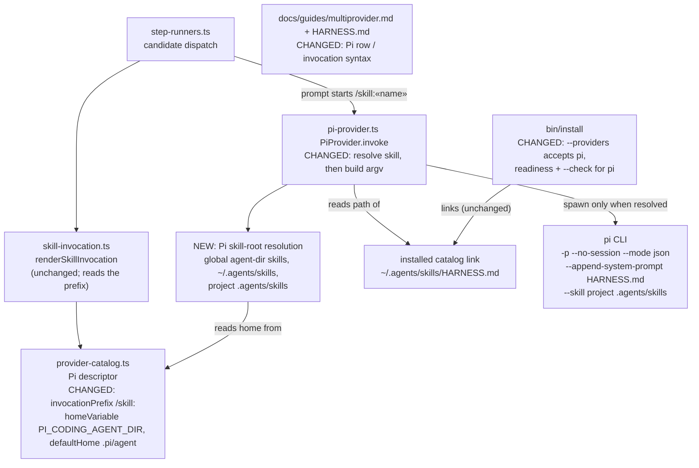
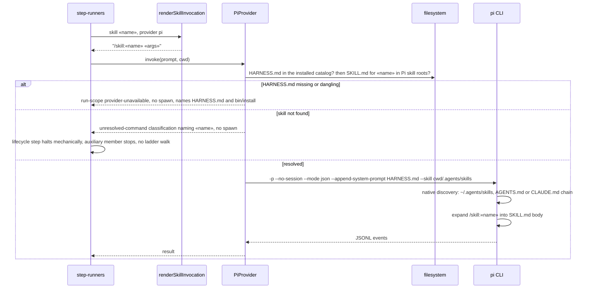

# Architecture: Harness skills and context files reach Pi sessions (#1888)

**Last updated:** 2026-09-29
**Scope:** How a Pi-dispatched step receives the harness skill catalog and HARNESS.md behavioral
rules the same way claude and codex dispatches do. It covers the Pi catalog descriptor, the Pi
adapter's argv and its pre-spawn skill-resolution refusal, and `bin/install --providers pi`.
Self-host provider homes (#1887), read-only review (#1886), and the `reviewPolicyCatalog`
capability (follow-up intake #2852) are out of scope.

## Current state (grounding)

- `execution/provider-catalog.ts:145-161`: the Pi descriptor has `invocationPrefix: ''`,
  `homeVariable: 'PI_HOME'`, `defaultHome: '.pi'`, and `capabilities: {}`. Pi 0.84.3 actually reads
  `PI_CODING_AGENT_DIR` (default `~/.pi/agent`).
- `engine/skill-invocation.ts:58-59`: `renderSkillInvocation` takes the prefix from the descriptor,
  so a Pi step's prompt currently starts with a bare word such as `pipeline`. Pi treats that as
  plain chat and loads no skill. Pi's real syntax is `/skill:<name>`, expanded inside
  `session.prompt()` in `-p` mode as well. An unknown name passes through unchanged.
- `execution/pi-provider.ts:129`: the argv is `-p --no-session --mode json`, with the prompt on
  stdin and the environment inherited. It passes no `--skill` or `--append-system-prompt`.
- What Pi discovers natively:
  - global skills from `~/.pi/agent/skills` and `~/.agents/skills` (`bin/install` already links
    every harness skill plus HARNESS.md into the latter)
  - project `.agents/skills` and `.pi/skills`, but only for a trusted project; `-p` ignores them
    by default
  - context files `AGENTS.override.md` > `AGENTS.md` > `CLAUDE.md` in each directory from the cwd
    up to the root, plus the global `~/.pi/agent/AGENTS.md`
  - `disable-model-invocation: true`, which hides a skill from the system prompt
- Claude gets HARNESS.md from the `SessionStart` hook (`hooks/claude/session-start-context.sh`).
  Codex gets it from prose in `AGENTS.md`. Pi runs no Claude hooks.
- `bin/install`: the `--providers` allowlist (`case claude|codex`), `choose_builtin_provider`,
  `report_selected_provider_readiness`, and `check_installation` know only claude and codex.
  Catalog linking always targets both `~/.claude/skills` and `~/.agents/skills`.

## Component view (L3)

## Sequence: a Pi-dispatched skill step

## Legend

- **CHANGED / NEW** mark the components this feature touches. Unmarked components already exist
  and keep their behavior.
- «name» is a skill name and «args» are its arguments.
- Pi-specific syntax (the `/skill:` prefix, `--skill`, `--append-system-prompt`, and the Pi skill
  roots) stays inside the catalog descriptor and `pi-provider.ts`. That follows ADR
  `adr-2026-09-24-built-in-provider-catalog-and-boot-discovery` D1, which bans provider-id literals
  elsewhere.
- `--skill <project>/.agents/skills` is added only when that directory exists.
  `--append-system-prompt` takes a file path, and Pi reads the file's contents.

## Change Log

| Date | Change | Reason |
|------|--------|--------|
| 2026-09-29 | Initial generation | DECIDE for #1888 (approach A: native Pi discovery + engine injection) |
| 2026-09-29 | Plan update: refusal classifications | Conflict-check aligned a missing skill with the existing unresolved-command classification; HARNESS.md is checked first |
