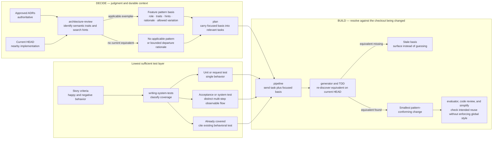

# Component Flow: Feature-Specific Pattern Reuse and Test Selection

**Last updated:** 2026-08-13  
**Scope:** The existing DECIDE and BUILD skills affected by issue #1552; no new runtime component, parser, manifest, or engine gate.

## Diagram

## Legend

- Exemplar paths and symbols are search hints. Line numbers are never part of the pattern basis.
- BUILD resolves the semantic traits against its current checkout; it does not copy an authoring-time snapshot.
- Approved ADRs outrank observed code. Code that conflicts with an approved decision is not precedent.
- The existing exact-copy `Pattern-source` / `Rename-map` flow remains governed by `adr-2026-08-09-declared-pattern-replication-in-build` and is unchanged.
- Test coverage follows behavior rather than production-file count or skill wording.

## Change Log

| Date | Change | Reason |
|------|--------|--------|
| 2026-08-13 | Initial design flow | DECIDE for issue #1552 |
| 2026-08-13 | Added the planned code-review consumer | Plan update for the complete non-`build_review` review path |
