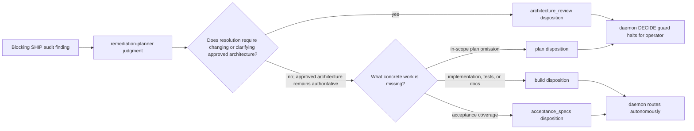

# Components: Remediation Authority Routing

**Last updated:** 2026-08-02
**Scope:** Classification and routing of blocking SHIP findings without changing the remediation JSON schema.

## Diagram

## Legend

- The planner retains the semantic judgment; no keyword or rationale-text parser is introduced.
- The closed rule distinguishes the authority required to resolve the finding from the validator that reported it.
- Existing daemon protection remains unchanged: any genuine DECIDE target still halts for an operator.
- The implementation plan changes the two instruction surfaces and proves their downstream routes at the bounded `planRemediation` seam; it introduces no new runtime component.

## Change Log

| Date | Change | Reason |
|------|--------|--------|
| 2026-08-02 | Initial feature flow | Specify issue #1250 without changing the remediation schema |
| 2026-08-02 | Confirmed plan wiring | Pin skill/agent contract tests and bounded engine-routing fixtures |
