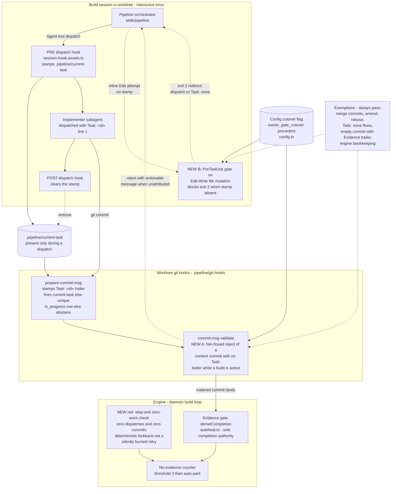
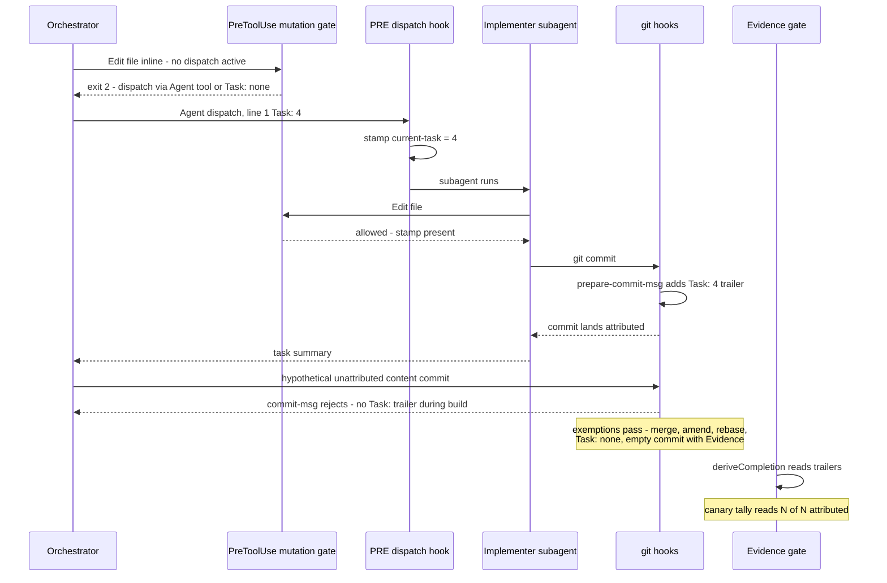
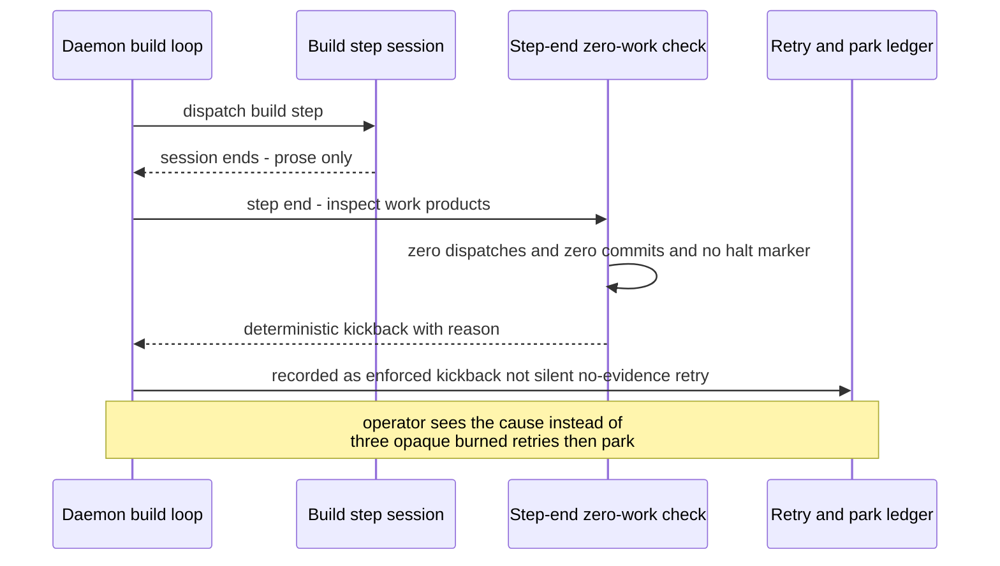

# Components: Inline Build-Work Attribution Enforcement (#505)

**Last updated:** 2026-07-10
**Scope:** The three new enforcement surfaces that make unattributed inline task work
impossible to create silently during a daemon build — (A) a fail-closed branch in the
worktree `commit-msg` git hook, (B) a session PreToolUse gate on file-mutation tools,
and (net) a zero-work-product step-end check — shown against the existing attribution
seam (dispatch session hooks, trailer stamping, evidence gate, auto-park).

## Diagram

## Legend

- **NEW A / NEW B / NEW net** — the three surfaces this feature adds; every other node is
  the existing merged seam (#452 git hooks, #494 dispatch session hooks, #481 evidence
  gate as sole completion currency).
- **A (commit gate)** — today `commit-msg` validates only trailers that are already
  present; a trailer-less content commit sails through. The new branch rejects it at
  creation with a redirect message, so the failure surfaces at the point of violation
  instead of three burned retries later.
- **B (dispatch shape)** — today inline implementation is forbidden by SKILL prose only.
  The new PreToolUse matcher makes the dispatch shape mechanical: file mutation without
  an active `current-task` stamp is refused at attempt time.
- **net (zero work product)** — a build-step session that ends with zero dispatches and
  zero commits (the prose-victory class) is detected deterministically and kicked back;
  shipped #459 covers only sessions that deliberately write a stall marker.
- **Cutover flag** — both blocking surfaces are gated by a config cutover following the
  `owner_gate_cutover` pattern, so existing repos and in-flight builds are grandfathered.
- `«…»` — placeholder for a variable value.

## Change Log

| Date | Change | Reason |
|------|--------|--------|
| 2026-07-10 | Initial generation | DECIDE phase for intake #505 |

# Sequence: inline attempt redirected, dispatched work attributed, escape rejected

# Sequence: zero-work-product session kicked back deterministically

