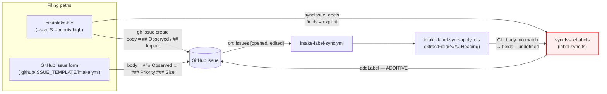
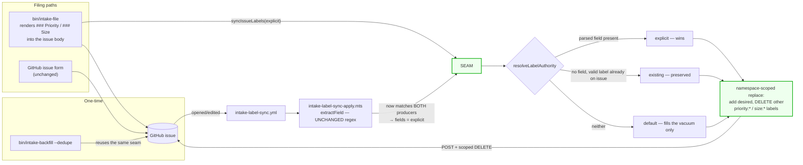

# Architecture: intake label authority (#889)

**Date:** 2026-07-23
**Scope:** C4 level 3 (component) for the intake label-stamping path only.
**Source:** jstoup111/ai-conductor#889

## Today (defective)

Two writers, both additive, neither aware of the other. The CLI resolves an explicit
value; the workflow independently re-derives one and — because a CLI-authored body
carries no `### Priority`/`### Size` headings — always falls through to its defaults,
then **adds** them on top.

**Failure:** `addLabel(priority: medium)` + `addLabel(size: M)` land beside the CLI's
`priority: high` / `size: S`. Verified live: #889 was filed `--size S --priority medium`
and now carries `size: S` **and** `size: M` (priority survived only because the explicit
value coincided with the default).

## Target

One seam, one authority rule, one namespace-scoped convergence. The parser is unchanged
and still knows exactly one body shape — instead the **CLI is taught to emit that shape**,
so both writers independently derive the *same* value and ordering stops mattering.

## Key structural properties

- **Namespace-scoped, not set-replace.** The DELETE sweep touches only labels matching
  `^priority: ` / `^size: `. A true REST `PUT .../labels` full replace — the thing the
  workflow header currently *claims* — would strip `engineer:handled`, `blocked_by:#N`,
  and every hand-applied label on the issue. Scoping is what makes convergence safe.
- **Authority is layered, not positional.** `explicit > existing > default`. A default can
  never demote or overwrite a chosen value; it only fills an empty namespace.
- **The parser stays single-shape.** Zero regex change means the issue-form path is
  provably untouched — the strongest available guarantee for the "must not break what
  works today" constraint.
- **Convergence, not ordering.** Because both producers derive the same value, the
  open-vs-apply race (workflow GET landing before the CLI's POST) can no longer produce a
  divergent outcome; whoever runs last writes the same labels.
- **Cleanup rides the same seam.** `--dedupe` is the seam applied to already-filed issues
  with `fields = {}` (no parsed value), which by the authority rule means "keep what's
  there, collapse the namespace" — not a second, parallel implementation.
