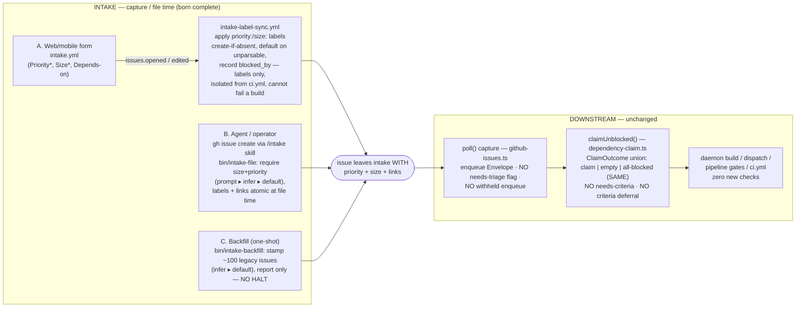

# Architecture: Intake-only criteria enforcement

**Issue:** #695 · **Stem:** `intake-only-enforcement` · **Tier:** M (lightweight diagram)

## One-line

Priority + size + linking are stamped at the moment an issue is **filed** (born
complete), across every capture surface. Nothing downstream re-checks them, so
there is no place a missing label can fail.

## Capture surfaces (where "born complete" is enforced)

`*` required (form) or required-then-defaulted (filing helper). "Default" = a
deterministic fallback (`size: M`, `priority: medium`) applied when the field is
absent or unparsable — never an error.

## Invariants

1. **Born-complete:** an issue that has passed any capture surface (A/B/C) carries
   a `priority:` label, a `size: S|M|L` label, and an explicit dependency-linking
   decision (a `blocked_by` set, possibly empty-by-acknowledgement).
2. **No downstream re-check:** `claimUnblocked` and its `ClaimOutcome` union stay
   byte-identical to `main`; `poll()` gains no blocking flag; the daemon/pipeline/CI
   add zero criteria checks. There is no `needs-criteria` outcome, no HALT, no
   dispatch/build/CI rejection tied to priority/size/links.
3. **Fail-soft, never fail-closed:** every stamping surface, on any error, either
   applies the sensible default or logs-and-continues. It never blocks filing,
   capture, dispatch, or a build.

## Data flow of a single label

`form field / helper arg / backfill inference` → normalize to closed vocab
(`parseSizeLabel` / `parsePriorityLabels`) → REST label apply (`restAddLabelArgs`
idiom) → issue is born complete. Read-back on capture is informational only; it
never gates.
