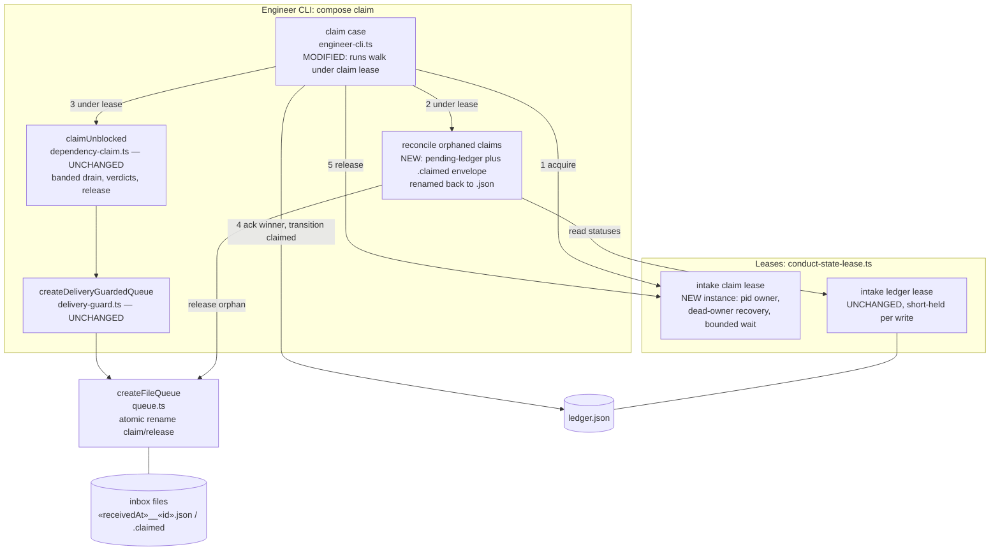

# Components: Lease-guarded intake claim walk (#2733)

**Last updated:** 2026-10-02
**Scope:** The `compose claim` path — where the intake claim lease and orphan reconciliation hook
into the existing banded dependency-claim walk.

## Diagram

## Legend

- **NEW / MODIFIED** nodes are this feature; everything else exists today.
- The claim lease is a second `createConductStateLease` instance on its own path, independent of
  the ledger lease and of `daemon-lock.ts` (ADR-011 constraint preserved). The ledger lease is
  still taken briefly per ledger read/write *inside* the claim lease; the reverse nesting never
  happens, so there is no lock-order inversion.
- Invariant that makes reconciliation safe: a successful claim acks (deletes) the winning
  envelope before its ledger entry becomes `claimed`, so outside a held walk no `.claimed` file
  can legitimately pair with a `pending` ledger entry. Holding the claim lease proves no other
  walk is live.
- A claimer killed mid-walk leaves its lease owned by a dead pid; the next claim recovers it via
  the existing dead-owner path and then reconciles the stranded batch.
- `.claimed` envelopes whose ledger entry is `done` or absent are out of scope and untouched.

## Change Log

| Date | Change | Reason |
|------|--------|--------|
| 2026-10-02 | Initial generation | DECIDE phase for issue #2733 |
