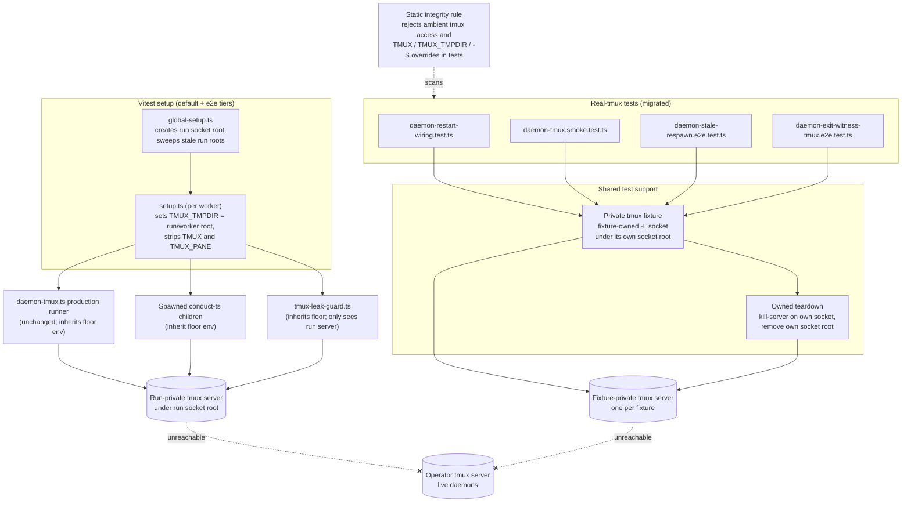
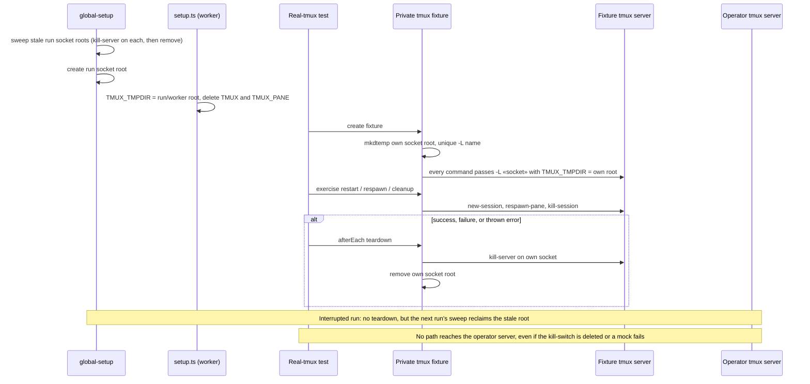

# Components and sequences: Real-tmux test isolation from operator sessions

**Last updated:** 2026-10-03
**Scope:** To-be test-infrastructure isolation for jstoup111/ai-conductor#2476. Feature:
`isolate-real-tmux-tests-from-operator-sessions`. Covers the vitest default and e2e tiers'
setup, a run-level tmux socket floor inherited by the whole test process tree, a shared
fixture-owned private-socket runner, the real-tmux tests that migrate onto it, the existing
tmux leak guard, and a static integrity rule. Production `daemon-tmux.ts` behavior and its
`AI_CONDUCTOR_NO_REAL_EXEC` kill-switch are shown only to mark them unchanged.

Verified probe (tmux 3.6, 2026-10-03): with `TMUX` unset and no `-L`/`-S`, the tmux client
resolves its server socket at `$TMUX_TMPDIR/tmux-«uid»/default`; a set `TMUX` variable
overrides `TMUX_TMPDIR`. The floor therefore both sets `TMUX_TMPDIR` and strips `TMUX`/`TMUX_PANE`.

## Component diagram

## Sequence: fixture lifecycle under the run-level floor

## Legend

- **Run-level floor:** the environment set by vitest setup that every tmux client in the test
  process tree inherits, including production `defaultTmuxRunner` calls and spawned children.
- **Fixture-private server:** a per-fixture server addressed only by its own `-L` socket name
  under its own `TMUX_TMPDIR` root; teardown never addresses any other server.
- Dashed `-x` edges mark isolation boundaries: no connection is possible.

## Change Log

| Date | Change | Reason |
|------|--------|--------|
| 2026-10-03 | Initial generation | DECIDE for #2476 (Approach C, Medium) |
| 2026-10-03 | Removed `daemon-lifecycle.e2e.test.ts` from migrated tests | It uses a mocked runner; its only real-tmux use is the server-less `tmuxInstalled()` probe |
