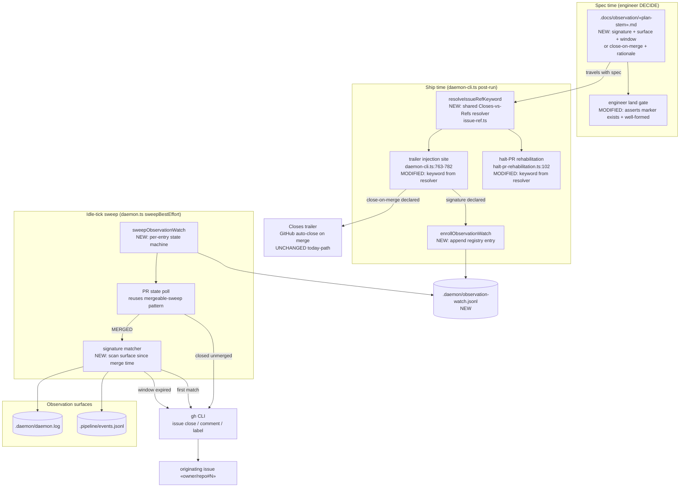
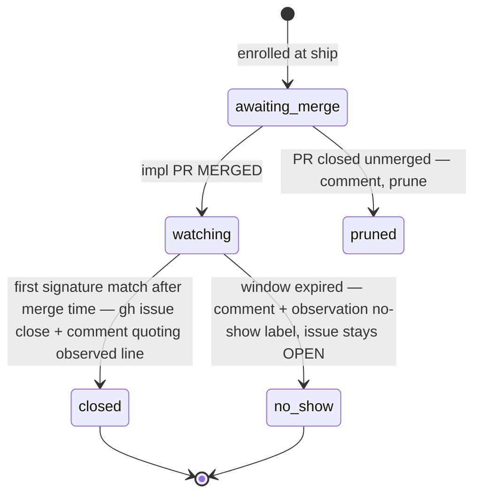

# Components: Observed-close — issues close on first production observation (#492)

**Last updated:** 2026-07-10
**Scope:** The post-ship issue-close path — where the observation signature is declared,
how ship-time trailer injection becomes conditional, and the new observation-watch
registry + sweep that closes the originating issue only after the fixed behavior is
observed in production (or flags a no-show).

## Diagram

## Lifecycle

## Legend

- **NEW / MODIFIED** nodes are this feature; everything else exists today.
- The `Closes`-trailer path survives unchanged for fixes whose marker declares
  `close-on-merge` (mandatory declaration; legal for inherently unobservable fixes —
  docs, refactors, consumer-app behavior invisible to the daemon). Only the close
  *trigger* moves for watched fixes; PR↔issue linking (`Refs`) is kept in both cases.
- `sweepObservationWatch` is best-effort and piggybacks `sweepBestEffort` (startup +
  every idle tick) exactly like `sweepMergeableLabels` — no new loop, no new process.
- Matching counts only observations timestamped **after** the impl PR's merge time,
  closing the merged ≠ loaded ≠ exercised race (#482): a well-chosen signature is a
  line only the new code can emit, so its first post-merge appearance proves all three.
- The `no_show` terminal is deliberate: never seeing the signature inside the window is
  the green-but-unwired alarm (#462) — the issue stays open and visibly flagged.
- Registry is `.daemon/*.jsonl` file-backed (mergeable-watch precedent): durable across
  daemon restarts, per-repo, no cross-repo state.

## Change Log

| Date | Change | Reason |
|------|--------|--------|
| 2026-07-10 | Initial generation | DECIDE phase for issue #492 |
| 2026-07-10 | Added shared keyword resolver + halt-PR rehabilitation as second injection site | Conflict resolution (blocking: rehab re-injected Closes) + plan update |
