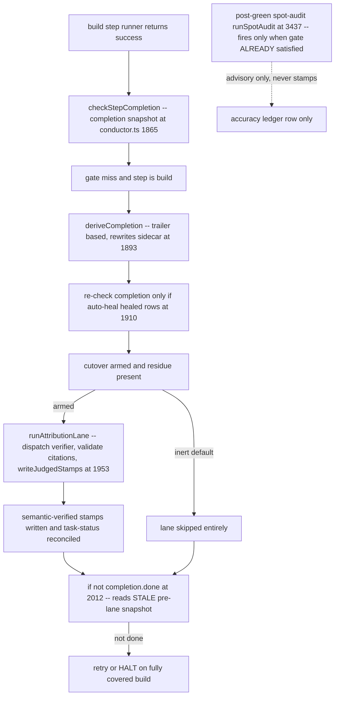
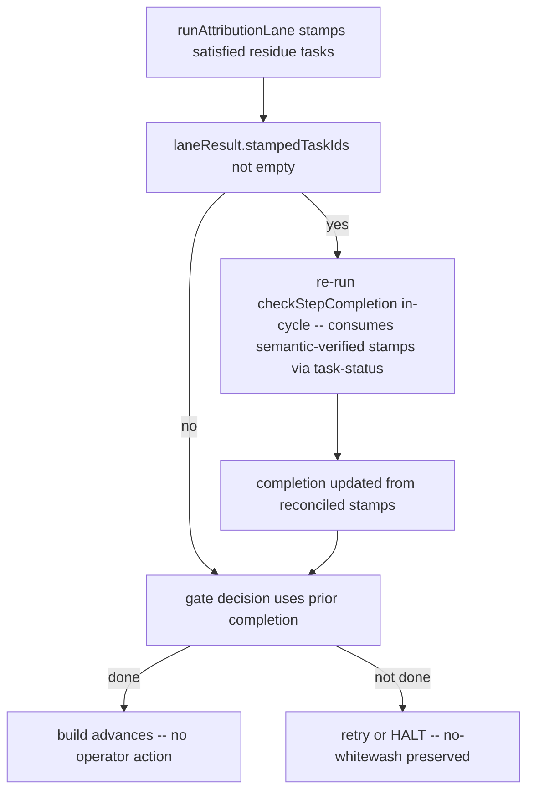

# Architecture: judged-attribution-verdict-persistence

**Source:** jstoup111/ai-conductor#581
**Track:** technical · **Tier:** M

## Context (C4 — component level)

The build-completion gate, the attribution judge lane, and the evidence sidecar sit in
the conductor engine. Today the judge's satisfied verdict cannot flip the current
build's halt decision. Two verdict paths exist; neither wires a satisfied verdict into
the in-cycle gate.

## Current flow (the defect)

The stale-snapshot edge (`stamps --> decision` where `decision` reads the pre-lane
`completion`) is the decisive defect: the lane's stamps land in the sidecar and
task-status is reconciled, but the halt decision never re-reads completion in the same
attempt. The lane's own comment (conductor.ts:1999-2007) defers the effect to "the next
gate evaluation cycle" — which never arrives when retries are exhausted.

## Target flow (the fix)

## Key components touched

| Component | File | Role in fix |
|---|---|---|
| Build gate orchestration | `conductor.ts:1863-2012` | Add in-cycle re-check after the lane stamps tasks |
| Attribution lane | `attribution-lane.ts:354-532` | Unchanged contract; already returns `stampedTaskIds` |
| Judged-stamp writer | `task-evidence.ts:181-225` | Unchanged; already persists + reconciles |
| Completion derivation | `autoheal.ts:573-730` | Precedence: a `semantic-verified` sidecar stamp must not be discarded by a failed trailer path-corroboration for the same task id |
| Task-status reconcile | `autoheal.ts:1278` | Already form-agnostic; consumed by the re-check |

## Invariants (must hold post-fix)

1. **In-cycle rescue:** a stamp written by the lane flips the *current* attempt's gate.
2. **No whitewash:** only `satisfied` + validated-citation + passing-test verdicts stamp;
   `no-verdict` / `unsatisfied` / refused stamp nothing and still refuse.
3. **Precedence:** a `semantic-verified` stamp for task N wins over a mis-attributed
   trailer commit that fails path corroboration for N (the #576 residue case).
4. **Byte-identical when inert:** with cutover absent (default), behavior is unchanged.
