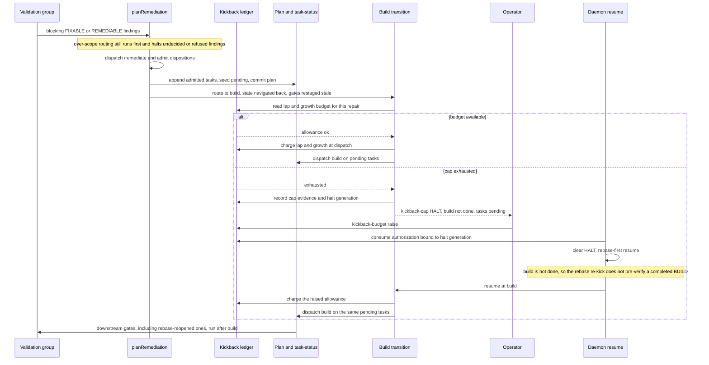

# Sequence: Kickback cap halts at the remediation→build transition

**Last updated:** 2026-09-29
**Scope:** Proposed flow for #2753. It moves every remediation kickback-cap halt (prd_audit lap,
plan-growth, as-built lap) from inside `planRemediation` to the build dispatch that follows it,
so a consumed `kickback-budget raise` resumes straight into build. There is no new process, store,
halt class, or event type. It extends the conductor, the existing kickback ledger, and the
daemon resume path.

## Diagram

## Responsibilities and limits

- **`planRemediation` stops enforcing caps.** It still owns over-scope ordering, /remediate
  dispatch, disposition admission, the single appender (adr-2026-08-25 D5), and the plan commit.
  Its three post-remediate cap exits and the #2755 pre-remediate lap-cap check move out.
- **The build transition owns the cap.** It decides from the ledger and the admitted repair whether
  this dispatch may proceed. It charges laps and growth when it dispatches, not when tasks are
  appended, and halts with the existing `kickback-cap` class and recovery hint.
- **The halt must persist a non-done BUILD.** The rebase re-kick pre-verifies BUILD only when
  `build === 'done'` (`engine/daemon-rekick.ts` ~879). With pending tasks that check would fail, and
  it would write a new "completed BUILD evidence is unavailable" halt. Existing repair work is
  already represented as a non-done BUILD, and the re-kick routes it normally.
- **An existing-task disposition appends nothing.** It is still charged a lap at the transition and
  charges no growth (adr-2026-08-25 D9).
- **No-append fallback.** A halt with no appended repair (for example a no-op escalation or an
  unrecognized disposition) keeps today's behavior.

## Evidence and design status

Verified:

- The cap exits in `planRemediation` return before `appendRemediationTasks` (`engine/conductor.ts`
  ~5260-5360).
- The #2755 pre-dispatch check runs at ~4723.
- Over-scope halts run before both (~4691-4714 and ~8835).
- The resume authorization is consumed only against the live `kickback-cap` halt.
- The re-kick BUILD pre-verify is gated on `build === 'done'` (`engine/daemon-rekick.ts` ~879).

Open for architecture review:

- How the pending, uncharged repair is represented durably across the halt: a ledger field versus
  deriving it from non-done BUILD plus appended ids.
- How the D4 lap and growth accounting is restated when charging moves from append to dispatch.
- Whether an as-built pending finding (`pendingAsBuiltRemediationFindings`) is written at append or
  at dispatch.

## Legend

Participants run inside the conductor or daemon process. The kickback ledger is the existing
version-1 `.pipeline` ledger. Plan and task-status are the active plan file and
`.pipeline/task-status.json`.

## Change Log

| Date | Change | Reason |
|---|---|---|
| 2026-09-29 | Initial sequence | Operator chose the transition-step halt for #2753 |
| 2026-09-29 | Plan update: settlement ordering after pre-dispatch refusal, malformed-record fail-closed, lap-only existing-task charge keyed by obligation id | Plan and conflict-check resolution |
