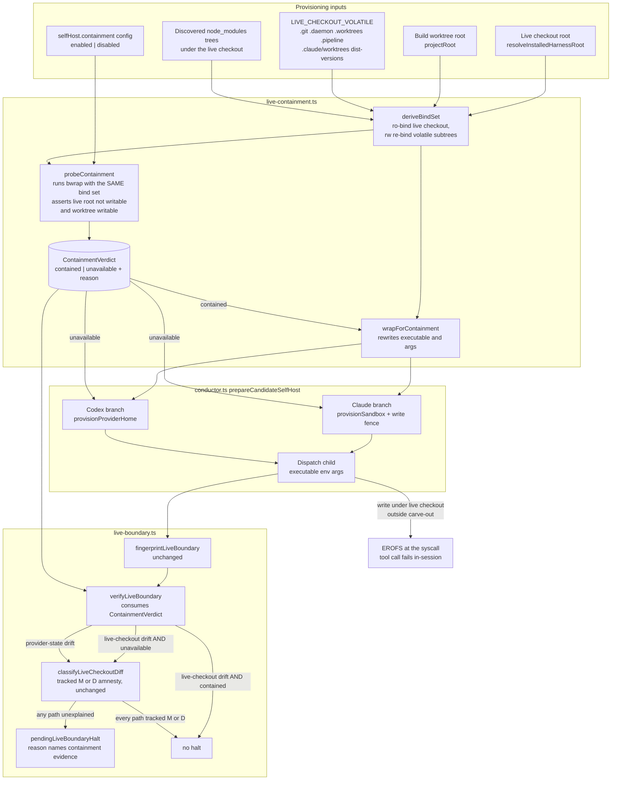

# Components: Kernel-enforced live-checkout containment for self-host dispatches

**Last updated:** 2026-08-17
**Scope:** Replaces after-the-fact attribution of live-checkout drift with structural
containment of the self-host dispatch child, keeping `verifyLiveBoundary` as the fail-closed
backstop. Issue jstoup111/ai-conductor#1301.

## Diagram

## Component responsibilities

### `live-containment.ts` (new)

Owns the whole containment concern so neither `conductor.ts` nor `live-boundary.ts` grows
OS-sandbox knowledge.

- **`deriveBindSet(liveCheckout, worktreeRoot)`** — a pure function returning the ordered
  bind arguments: a full host `--dev-bind / /`, then `--ro-bind <liveCheckout>
  <liveCheckout>`, then a read-write `--bind` for each existing carve-out path. The
  carve-out is `LIVE_CHECKOUT_VOLATILE` (imported from `live-boundary.ts`, not restated)
  plus every `node_modules` directory discovered under the live checkout. Order is
  load-bearing: bwrap applies binds in sequence, so a later read-write bind must overlay the
  earlier read-only one.
- **`probeContainment(bindSet, liveCheckout, worktreeRoot)`** — runs `bwrap` once with the
  *same* bind set and asserts two things: the live checkout root is **not** writable, and the
  worktree root **is** writable. This proves the derived bind set, not merely that `bwrap`
  exists — a wrong carve-out is caught before the dispatch spends a single turn.
- **`wrapForContainment(command, bindSet)`** — rewrites `{ executable, args }` to
  `{ executable: 'bwrap', args: [...bindSet, '--', originalExecutable, ...originalArgs] }`.
  `env` is passed through untouched, so the throwaway `CLAUDE_CONFIG_DIR` / `CODEX_HOME`
  isolation is unaffected.
- **`ContainmentVerdict`** — `{ contained: true, evidence }` or
  `{ contained: false, reason }`. This is the value the guard consumes; it is passed
  in-process from provisioning to `verifyLiveBoundary`, not written to a sidecar file.

### `conductor.ts` — `prepareCandidateSelfHost`

The single wrap seam. Both the Codex branch (`:3157-3174`) and the Claude branch
(`:3175-3190`) already return `{ executable, env, args, teardown }`; each now runs its
result through `wrapForContainment` when the verdict is `contained`, and returns it unchanged
when it is not. The verdict is captured in the closure that `verify()` already uses to write
`pendingLiveBoundaryHalt`, so no new plumbing is required to get it to the guard.

Provider neutrality is structural here: the wrap happens on the common return shape, after
the provider-specific provisioning, so Codex gains containment despite having no write fence.

### `live-boundary.ts` — `verifyLiveBoundary`

Gains one input — the `ContainmentVerdict` — and one branch. When the live-checkout surface
differs **and** the verdict is `contained`, the drift is positively attributable to something
other than the dispatch and the surface does not halt; the evidence string is logged. When
the verdict is not `contained`, behavior is byte-for-byte what it is today: git
classification, then halt with `describeDiff`. The provider-state surface is untouched —
containment says nothing about `~/.claude`, which lives outside the live checkout.

`fingerprintLiveBoundary`, `LIVE_CHECKOUT_VOLATILE`, `diffManifests`, `describeDiff`, and
`classifyLiveCheckoutDiff` are unchanged. No exclusion is added, so outcome 5 holds: every
config-like path stays fingerprinted.

## Why containment rather than attribution

The write fence (`write-fence.ts:253-266`) already implements the policy "block every write
under the harness root that is outside the build worktree". `adr-2026-07-08` accepted that
its Bash enforcement is heuristic and deliberately made it the second layer. Containment does
not change that policy and does not promote the fence to load-bearing — it enforces the same
policy at the syscall instead of at a hook, which is what makes the resulting verdict usable
as attribution evidence.

## Failure modes

| Condition | Behavior | Evidence in the reason |
|---|---|---|
| `bwrap` absent or non-executable | dispatch runs uncontained; guard behaves as today | `containment unavailable: bwrap not found` |
| Probe says live root writable | dispatch runs uncontained; loud WARN | `containment unavailable: probe found <path> writable` |
| Probe throws / non-zero for any other reason | dispatch runs uncontained | `containment unavailable: probe failed — <stderr>` |
| Containment disabled by config | dispatch runs uncontained | `containment disabled by configuration` |
| Contained, live checkout drifted | no halt | `live checkout changed but dispatch ran contained (ro-bind); attributed to a concurrent operator session` |
| Contained, dispatch attempts a live-checkout write | write fails `EROFS` in-session | tool error surfaces to the step, not a post-hoc halt |
