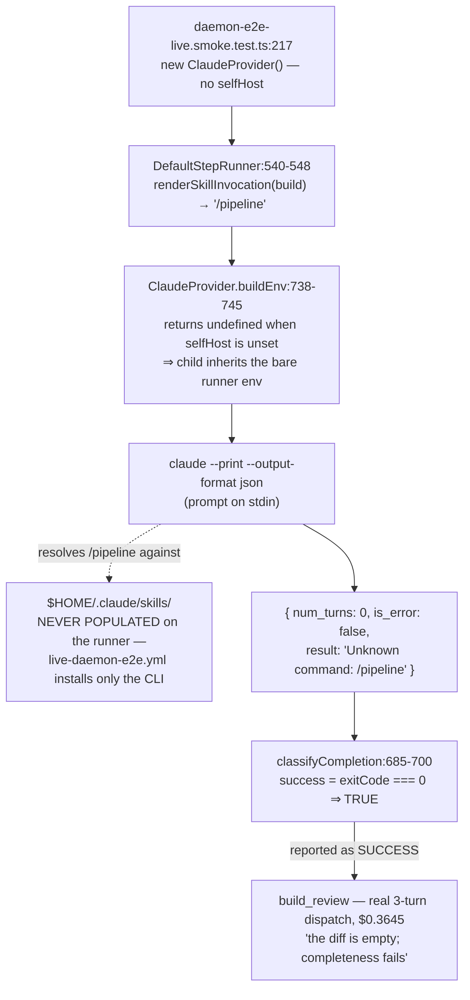
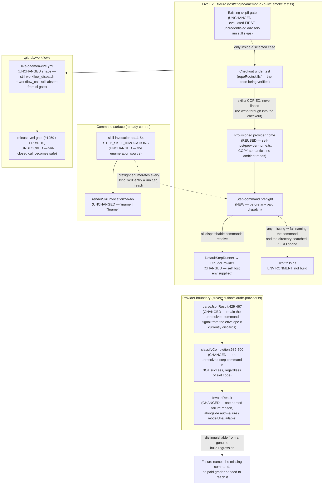

# Components: Live daemon E2E build step never runs a real agent

**Last updated:** 2026-08-04
**Scope:** To-be view for `live-daemon-e2e-build-step-never-runs-a-real-agent`
(jstoup111/ai-conductor#1311, Tier M, technical track). Gives the live daemon E2E
fixture its own provisioned provider home so a dispatched harness step command
resolves, and makes an unresolvable step command fail by name — before spend at the
fixture boundary, and at the provider boundary for every other caller.

## As-is: why the build step returns in 43 ms

The failure is attributed nowhere along that path: the provider calls it a success,
the conductor advances, and the first thing that objects is a paid grader complaining
about an empty diff. `install-freshness.ts:1-15` already describes this exact class,
but its `bin/install --check` guard runs at `daemon-cli.ts:704` — the daemon *entry
point*, which this fixture bypasses by calling `runDaemon()` as a library.

## To-be

## Component responsibilities

| Component | Status | Responsibility |
|---|---|---|
| `test/engine/daemon-e2e-live.smoke.test.ts` | CHANGED | Owns its provider environment. Provisions a home from the checkout under test, preflights, tears down on both branches. |
| `src/engine/self-host/provider-home.ts` | REUSED | Builds an isolated provider home from a root's `skills/` by **copying**, prunes operator-only skills, fails closed on a missing `skills/`, reads no operator state, and tears down. Provider-neutral, so the reserved Codex leg is one entry plus a credential. |
| `src/engine/self-host/sandbox-build-env.ts` | NOT USED | Deliberately not the primitive here: it symlinks (a write-through path into the checkout) and reads the operator's `~/.claude.json`. It remains correct for genuine self-host builds. |
| `src/engine/skill-invocation.ts` | UNCHANGED | The enumeration source for registry-rendered commands. The preflight reads it; nothing hardcodes `pipeline`. Config-declared custom and parallel-branch steps dispatch outside it (`step-runners.ts:546-548`) and are a stated non-covered surface. |
| `src/execution/claude-provider.ts` | CHANGED | Stops reporting an unresolved step command as success. Narrow classification only — no new flags, no argv change. |
| `.github/workflows/live-daemon-e2e.yml` | UNCHANGED | Trigger shape, matrix, advisory/gate modes and `ci-gate` absence are all preserved (`adr-2026-08-02-live-smoke-manual-dispatch-and-reusable-gate`). |
| `src/engine/install-freshness.ts` | UNCHANGED | Keeps guarding the operator's global catalog at daemon entry. The new checks cover the paths it structurally cannot see. |

## Boundaries this work does not cross

- **No new assertion on agent behavior.** `adr-2026-08-02-live-tier-asserts-outcomes-not-scripts`
  still governs: terminal state, committed artifacts, token cap. Turn counts stay
  diagnostic, never an outcome assertion.
- **No global mutation on the runner or the operator's machine.** Nothing runs
  `bin/install` in CI and nothing writes `~/.claude`.
- **No write of any kind into the checkout under test.** Skills are copied, never linked,
  so a concurrent self-host build's live-boundary fingerprint cannot be disturbed.
- **No change to the advisory/gate skip semantics.** The existing credential and CLI skip
  predicate is evaluated first and keeps its meaning; provisioning runs only inside a
  selected case.
- **No workflow trigger change.** The tier stays out of `ci-gate` and off the
  pull-request path.
