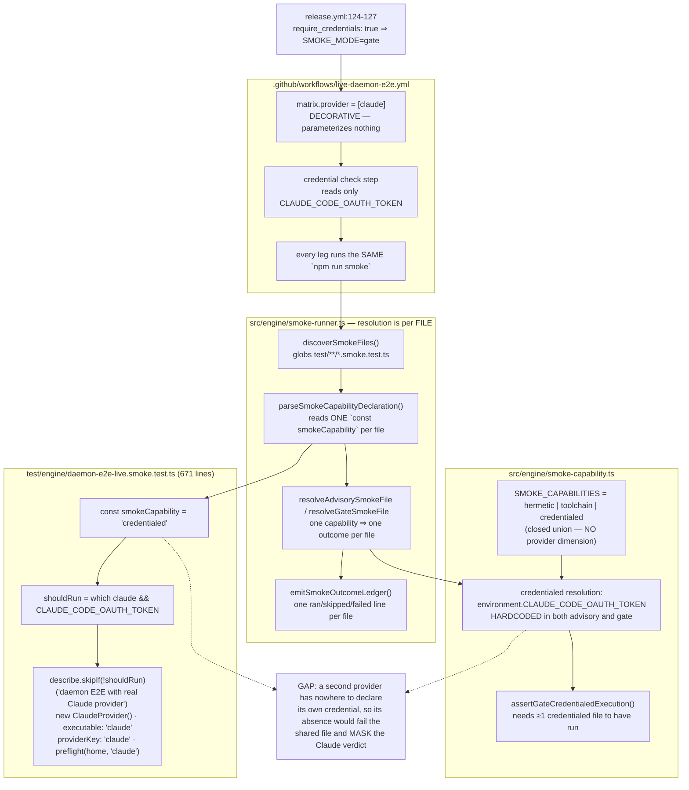
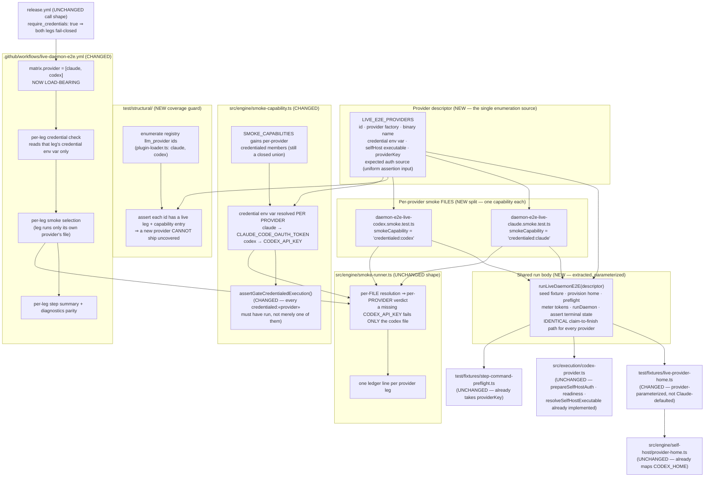

# Components: Live daemon E2E tier covers only Claude — no real-agent Codex signal

**Last updated:** 2026-08-12
**Scope:** To-be view for `live-daemon-e2e-tier-covers-only-claude-no-real-ag`
(jstoup111/ai-conductor#1264, Tier M, technical track). Gives the live daemon E2E tier a
second real-agent leg for Codex by parameterizing the run body over a provider descriptor,
making the `credentialed` smoke capability provider-aware so each leg's verdict is
independent, and adding a coverage guard so a registered `llm_provider` cannot ship without
a live leg.

## As-is: one file, one capability, one provider

The intake's hypothesis — "an additive matrix entry plus a credential variable" — holds at the
`provider-home.ts` layer (already provider-neutral) but **not** at the capability layer: the
`credentialed` capability has no provider dimension, and the workflow matrix parameterizes
nothing today.

## To-be

## Component responsibilities

| Component | Status | Responsibility |
|---|---|---|
| `LIVE_E2E_PROVIDERS` descriptor manifest | NEW | The single place a provider's live-leg facts live: id, provider construction, binary name, credential env var, self-host executable, `providerKey`. Every other component derives from it rather than repeating a literal `'claude'`. |
| Shared parameterized run body | NEW | Holds the seed/provision/preflight/meter/`runDaemon`/assert sequence exactly once, so both legs provably drive the same claim-to-finish path. Extracted from the existing 671-line file without changing its assertions. |
| `daemon-e2e-live-«provider».smoke.test.ts` | NEW (Claude leg is a split of the existing file) | One thin file per provider declaring that provider's capability. File granularity is what makes verdicts independent — see the ADR on why this is not an in-file loop. |
| `src/engine/smoke-capability.ts` | CHANGED | The closed capability union gains per-provider credentialed members; credential resolution maps each provider to its own env var in both advisory and gate mode; the gate assertion requires every declared provider leg to have run, not merely one credentialed file. |
| `src/engine/smoke-runner.ts` | UNCHANGED | Its existing per-file discovery, resolution, ledger, and failure recording already deliver per-provider isolation once the split exists. No new channel, no second runner. |
| Provider-enumeration coverage guard | NEW | Reads the registered `llm_provider` ids and fails when one has no live leg or no capability entry. This is the deterministic mechanism behind desired outcome 5 — not a prompt-level or review-time reminder. |
| `test/fixtures/live-provider-home.ts` | CHANGED | Stops defaulting to a Claude `ResolvedSelfHostProvider`; takes the descriptor's provider and credential so the same fixture provisions either home. |
| `src/engine/self-host/provider-home.ts` | UNCHANGED | Already provider-neutral: `HOME_VARIABLE` maps `codex → CODEX_HOME`, and `childEnv()` already strips ambient `CODEX_HOME`/`CLAUDE_CONFIG_DIR`/`CLAUDE_CODE_OAUTH_TOKEN`. |
| `src/execution/codex-provider.ts` | UNCHANGED | Already implements `resolveSelfHostExecutable`, `prepareSelfHostAuth` (emits `CODEX_API_KEY`), and `readiness`. The leg consumes these; it does not modify dispatch behavior. |
| `test/fixtures/step-command-preflight.ts` | UNCHANGED | Already accepts a `providerKey` and renders `$name` versus `/name` per provider. The Codex leg passes `'codex'`. |
| `.github/workflows/live-daemon-e2e.yml` | CHANGED | The matrix becomes load-bearing: each leg checks only its own credential, runs only its own provider's smoke file, and emits its own step summary and failure diagnostics. |
| `.github/workflows/release.yml` | UNCHANGED | Keeps calling the tier with `require_credentials: true`. Once `CODEX_API_KEY` exists as a repository secret, the Codex leg becomes a real fail-closed release gate alongside Claude. |

## Boundaries this work does not cross

- **No change to production dispatch.** Nothing in `plugin-loader.ts`, `step-runners.ts`, or
  either provider's `invoke` path changes. This is harness coverage, not runtime behavior.
- **No new assertion on agent behavior.** `adr-2026-08-02-live-tier-asserts-outcomes-not-scripts`
  still governs both legs: terminal state, committed artifacts, token cap. Codex is held to the
  same outcome assertions as Claude, never to a Codex-shaped script.
- **No second telemetry or reporting channel.** Per-provider outcomes ride the existing smoke
  ledger and the existing GitHub step summary. No sidecar file, no parallel log.
- **No general live-tier framework.** The extraction is scoped to the daemon E2E run body; it
  does not become a reusable harness for other smoke files (excluded by the operator's scope
  boundary).
- **No relaxation of the release gate.** The Claude leg keeps its current fail-closed behavior
  unchanged; the Codex leg is added at the same strictness rather than as a tolerated advisory.

## Change Log

| Date | Change | Reason |
|------|--------|--------|
| 2026-08-12 | Initial generation | To-be view for the Codex live-leg spec (#1264) |
| 2026-08-12 | Descriptor carries each provider's expected authentication source | Plan-update. Resolves the conflict-check oscillation between the provider-agnostic shared body and the Codex auth-source assertion: the assertion becomes uniform and descriptor-driven rather than a provider name test |
