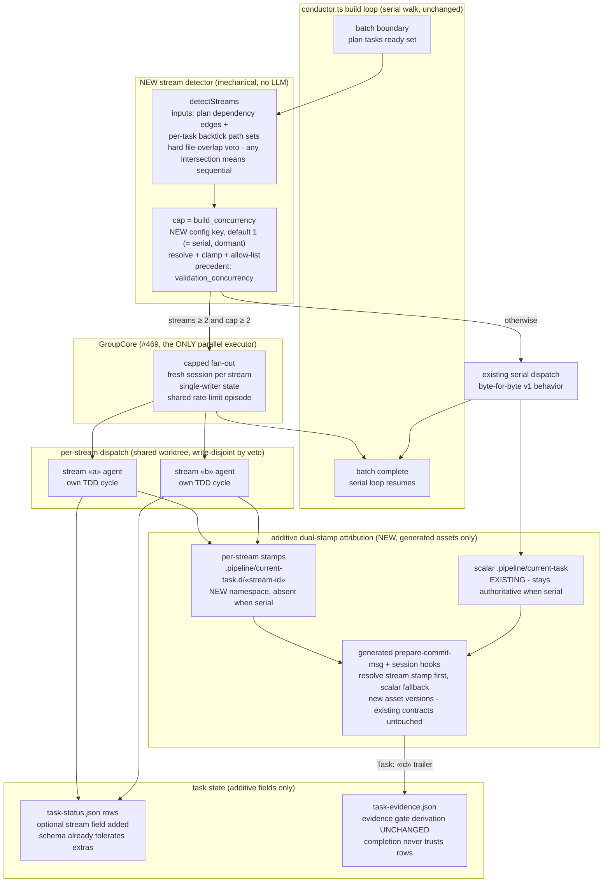

# Components: Parallel Task-Stream Dispatch — target dispatch boundaries (#474 spec-lock, #552)

**Last updated:** 2026-07-12
**Scope:** The TARGET architecture #474 will implement post-v1, as pinned by this spec's
ADRs. Shows the batch-boundary stream detector, GroupCore reuse (#469), the additive
dual-stamp attribution path, and the join back into the serial loop. Everything not
marked NEW is the existing engine, unchanged in v1. This is a DECIDE-only spec — no
component here ships in v1; the diagram exists so the pinned interfaces are visible.

## Diagram

## Legend

- **NEW** — components #474 adds post-v1. Nothing NEW ships in v1; the spec pins their
  interface shapes so they land as MINOR with no migration block.
- **build_concurrency** — new top-level `.ai-conductor/config.yml` key; default 1 keeps the
  feature dormant, so its addition is additive. Follows the `validation_concurrency`
  resolve+clamp+allow-list precedent from #469's APPROVED GroupCore ADR.
- **Dual stamp** — the scalar `.pipeline/current-task` file is untouched and remains the
  only stamp in serial mode; parallel streams each get `.pipeline/current-task.d/«stream-id»`.
  Generated hooks (engine-provisioned per worktree) gain stream-first resolution with scalar
  fallback — shipped as NEW generated asset content, never edits to consumer-owned hooks.
- **File-overlap veto** — stream detection is deterministic: dependency-edge independence AND
  empty pairwise intersection of per-task declared path sets; any overlap collapses to serial.
- **Evidence gate unchanged** — completion continues to derive from `task-evidence.json`
  stamps (H6–H8 invariants); `task-status.json` only gains optional fields.
- `«…»` — placeholder for a variable value.

## Change Log

| Date | Change | Reason |
|------|--------|--------|
| 2026-07-12 | Initial generation | DECIDE phase for #552 (#474 interface spec-lock) |
