# Components: v1 interface lock for parallel task-stream dispatch (#552, locking #474)

**Last updated:** 2026-08-02
**Scope:** Every consumer-visible surface that #474 (engine-orchestrated parallel task-stream
dispatch, deferred post-v1) would have to touch, and the point at which lane identity would
have to enter each one. The diagram distinguishes what is **PINNED FROZEN** (v1 shape is
final; #474 must work around it), what is **PINNED WIDENED** (v1 ships an additive,
forward-tolerant shape), and what is **RESERVED** (v1 accepts and ignores a name so a later
engine can honor it without a hard load failure).

## Surface map

```mermaid
graph TD
    subgraph Loop["Conductor loop thread - engine/conductor.ts (single writer)"]
        LOOP["step loop :2938<br/>walks buildStepRegistry"]
        GRP["group fan-out :3179-4086<br/>StepGroup, auto-mode only<br/>UNCHANGED by this feature"]
        KEY["synthetic state keys<br/>«step»__«branch» :3279<br/>PINNED FROZEN grammar"]
    end

    subgraph Cfg["Config surface - engine/config.ts"]
        ALLOW["knownTopLevelKeys :253-315<br/>unknown key = HARD load failure :316-320"]
        VC["validation_concurrency<br/>PINNED FROZEN name and meaning<br/>caps ALL fan-out, already a misnomer"]
        BC["build_concurrency<br/>RESERVED in v1 - validated, no consumer"]
        PB["ParallelBranch.name types/config.ts:43<br/>PINNED - charset validated in v1<br/>BREAKING-IN-V1, escalated"]
    end

    subgraph Plan["Plan contract - .docs/plans/«stem».md"]
        FILES["**Files likely touched:**<br/>parsePlanTaskPaths plan-task-parse.ts:70<br/>ALREADY PARSED per task"]
        DEPS["**Dependencies:** value<br/>presence-checked only artifacts.ts:3016<br/>PINNED WIDENED - grammar + fail-safe parser"]
    end

    subgraph Store["Pipeline stores - «worktree»/.pipeline/ (no schemaVersion anywhere)"]
        CT["current-task<br/>bare scalar, no newline task-cli.ts:153<br/>PINNED FROZEN - unique-or-absent"]
        LANES["lanes/ subtree<br/>RESERVED path for per-lane state"]
        TS["task-status.json<br/>tasks[] already per-task<br/>index signature tolerates new fields"]
        TE["task-evidence.json<br/>evidenceStamps per-task keyed OK<br/>counters are per-build scalars - RMW race"]
        DC["dispatch-count<br/>line grammar Task: «id»<br/>PINNED FROZEN - test-locked"]
        DL["dispatch-log.jsonl<br/>RESERVED path for lane correlation"]
        PA["phase-active<br/>PINNED FROZEN - one file per worktree,<br/>allow: prefixes are a UNION across lanes"]
    end

    subgraph Hooks["Shipped operator hooks - hooks/ (release-gate surface 'hook wiring')"]
        LINT["lint-after-edit.sh:66-67<br/>reads current-task as batch boundary<br/>MUST NOT CHANGE post-v1"]
        DG["docs-guard.sh<br/>reads phase-active allow: prefixes<br/>MUST NOT CHANGE post-v1"]
    end

    subgraph Gen["Engine-generated hooks - upgrade with the engine, NOT a pinned surface"]
        PRE["pre-dispatch session hook<br/>session-hook-assets.ts:17-140<br/>writes dispatch-count + flips row<br/>never writes current-task today"]
        PCM["prepare-commit-msg<br/>git-hook-assets.ts:17-74<br/>stamps Task: from current-task, abstains if absent"]
        CM["commit-msg<br/>validates id against task-status.json :157-174"]
    end

    subgraph Tele["Telemetry - consumer-visible contract"]
        SNAP["BuildProgressSnapshot<br/>currentTaskId = first in_progress row wins<br/>build-progress-watcher.ts:120-124"]
        EV["events.ts:296-297 / OTEL span attrs<br/>span-manager.ts:185,202<br/>PINNED WIDENED - add plural, keep scalar"]
    end

    CLI["conduct-ts task start|done «id»<br/>sole writer of current-task today<br/>PINNED FROZEN CLI contract"]

    LOOP --> GRP --> KEY
    ALLOW --> VC
    ALLOW --> BC
    ALLOW --> PB
    CLI --> CT
    CT --> LINT
    CT --> PCM
    PRE --> DC
    PRE --> TS
    TS --> CM
    TS --> SNAP --> EV
    TE -.per-build counters.-> SNAP
    PA --> DG
    DEPS -.#474 reads edges.-> GRP
    FILES -.#474 reads file sets.-> GRP
    LANES -.post-v1 only.-> CT
    DL -.post-v1 only.-> DC
```

## Where lane identity enters, and where it deliberately does not

| Slot | Today | Post-#474 need | Decision |
| --- | --- | --- | --- |
| State key space | `<step>__<branch>` synthetic keys already exist for the config `parallel:` DSL (`types/config.ts:43`) | `build__<stream>` | **Reuse as-is.** The grammar is already shipped and consumer-visible; only the branch-name charset needs fixing so `__` can never make a key ambiguous. |
| Commit attribution | one worktree-global scalar `current-task`, read by `prepare-commit-msg` | per-lane id | **New per-lane store under the reserved `.pipeline/lanes/`.** The scalar is frozen and becomes *absent* when lane count ≠ 1 — which is already every reader's abstain path. |
| Dispatch correlation | `dispatch-count` lines carry no dispatch identity; the host payload carries `tool_use_id` and `session_id` but no shipped hook reads them | lane ↔ dispatch ↔ commit correlation | **New reserved `.pipeline/dispatch-log.jsonl`.** `dispatch-count`'s grammar is frozen because its reader takes everything after `Task: ` as the id — widening the line in place would corrupt it. |
| Write serialization | `.pipeline/.task-status.lock` mkdir mutex, taken by the dispatch hook only | all writers | Engine-internal; no interface implication. Fixed in v1 because the race is real today. |
| Editor/lint/docs guards | `phase-active`, one file, `allow:` prefix lines | per-lane allow-lists | **Explicitly NOT lane-scoped.** Keeping this file worktree-global with a union of allow prefixes is what keeps `hooks/docs-guard.sh` and `hooks/lint-after-edit.sh` byte-for-byte unchanged post-v1 — the single decision that keeps the release gate's `hook wiring` surface untouched. |

## Boundary this diagram asserts

Engine-generated hooks (`session-hook-assets.ts`, `git-hook-assets.ts`) are **not** a pinned
surface: they are rewritten into every worktree at provisioning (`worktree-prepare.ts:399-417`)
and upgrade atomically with the engine, and their source paths trip no release-gate surface.
Hooks under `hooks/` are the opposite — installed once into the operator's global
`~/.claude/settings.json` with an absolute path (`bin/install:399, 426-435`), never re-synced
per build. That asymmetry is why the pins concentrate on the two files those hooks read.
