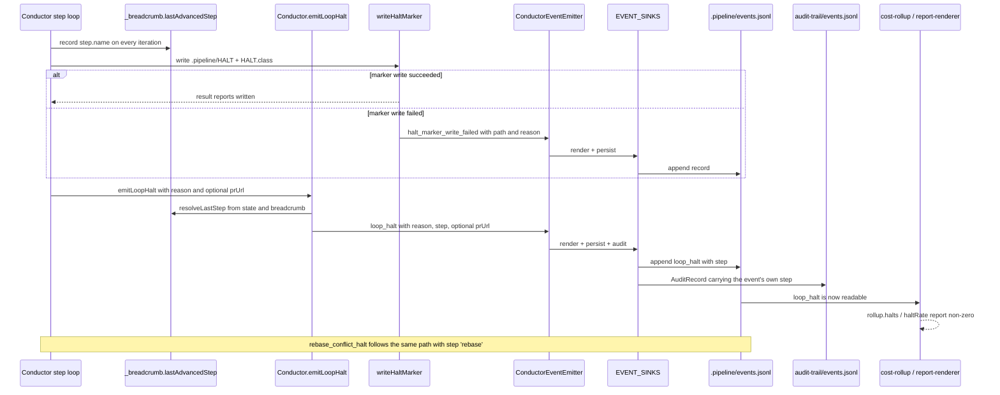

# Sequence: A halt becomes reconstructable from the persisted event spine

**Last updated:** 2026-08-11
**Scope:** Halt-class sink routing, central step stamping on `loop_halt`, and the halt
marker's write outcome as a spine occurrence.

## Diagram

## Legend

- The step loop already writes `breadcrumb.lastAdvancedStep` on every iteration
  (`conductor.ts:3923`); the stamp reads it rather than introducing new tracking.
- `resolveLastStep` (`conductor.ts:9391`) is the existing preference-ordered resolver —
  `state.last_step`, then the breadcrumb, then the furthest `done` step — and is reused
  unchanged, so a halt raised outside the loop still attributes a step.
- `emitLoopHalt` is the single conductor-owned emit path for `loop_halt`. Every existing
  emit site routes through it, so no site can omit the step and no future site can forget it.
- `EVENT_SINKS` is the only routing declaration; `EventPersister.start()` derives its
  subscriptions from `persistedEventTypes()`, so flipping `persist` is what wires the halt
  into the ledger. No persister change is required.
- `writeHaltMarker` stops returning `void`. It returns a result and, when an emitter is
  available, emits `halt_marker_write_failed` on the same bus. It still never throws — a
  failed marker write must not crash the finish flow.
- `.pipeline/HALT` remains durable state read by name (event-spine exception C). Only the
  *outcome of writing it* becomes an occurrence.
- The audit trail keeps its own shape; only its hardcoded `step: 'build'` is replaced by the
  event's own step, so the two streams stop disagreeing about where a halt happened.
- `appendFileSync` in `EventPersister` makes the halt record durable before process exit, so
  no flush or shutdown ordering work is needed.
