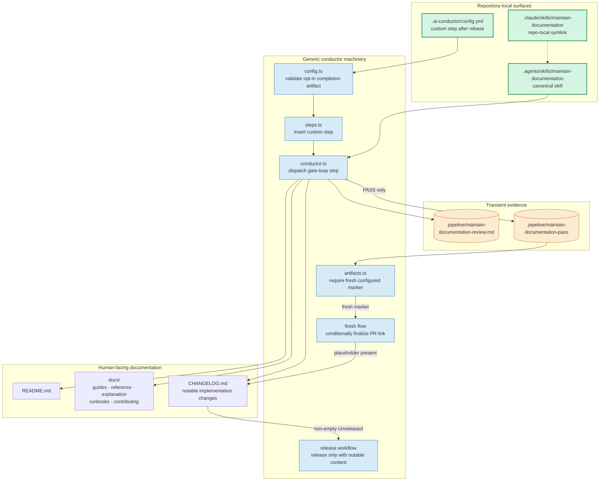

# Components: repository-local documentation maintenance

**Last updated:** 2026-07-25
**Scope:** The repository-local skill, opt-in custom-step completion contract, and conditional finish integration used only by this repository.

## Diagram

## Legend

- Green nodes are committed only in this repository.
- Blue nodes are generic conductor behavior that remains inert without explicit project configuration or a changelog placeholder.
- The release workflow exits successfully without mutation when `[Unreleased]` has no notable content.
- Orange nodes are transient, per-run evidence.
- The skill may read `.docs/` for context but has no write edge to `.docs/`.
- The direct-invocation symlink points to one canonical skill; no instructions are duplicated.

## Change log

| Date | Change | Reason |
|------|--------|--------|
| 2026-07-25 | Initial design | Define the Medium-tier technical architecture before implementation |
| 2026-07-25 | Add conditional release path | Resolve the notable-only changelog conflict without fake entries |
