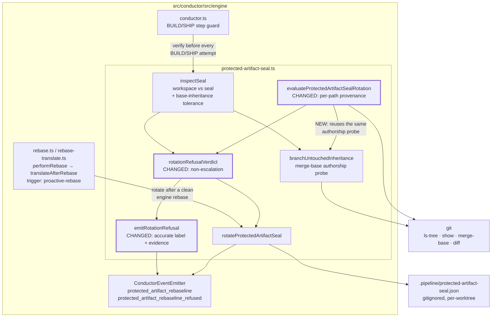
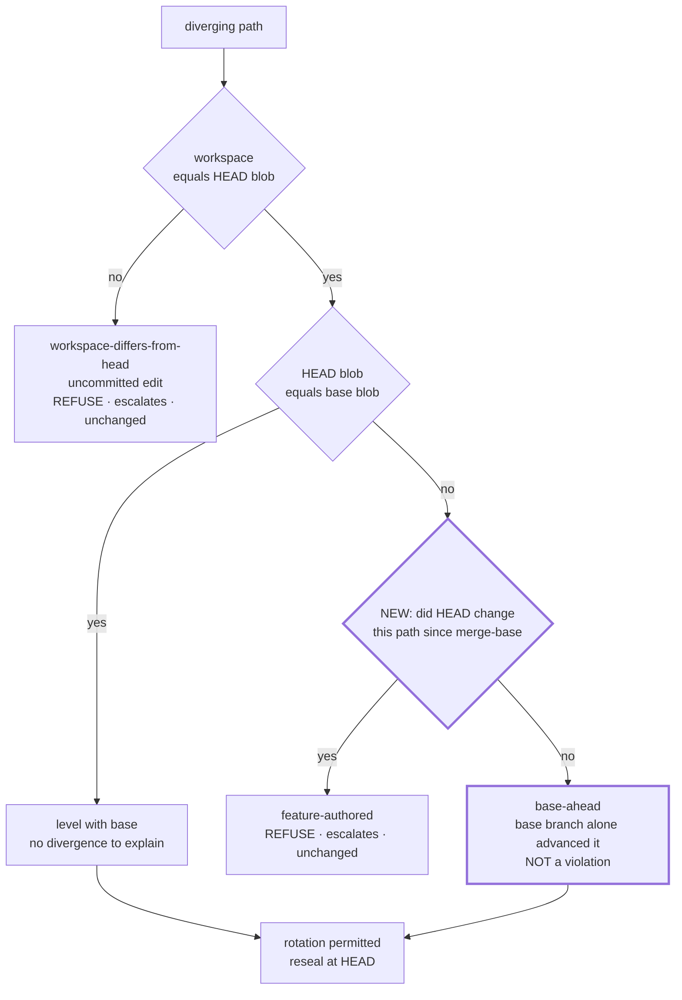
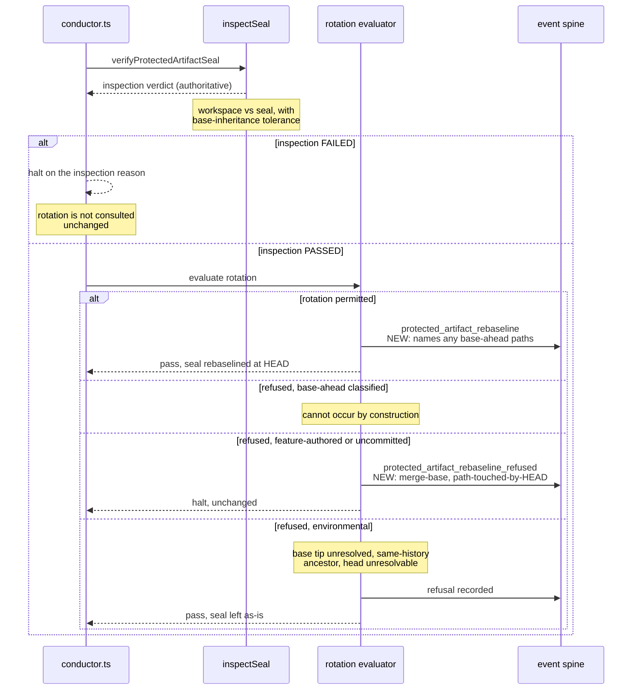

# Architecture: provenance-based seal rotation verdict (#1229)

**Stem:** `manual-rebase-strands-protected-artifact-seal`
**Tier:** M — lightweight architecture pass
**Supersedes the predicate established by:** `.docs/architecture/2026-07-26-rebased-features-stale-protected-artifact-seal-976.md`

## Scope

No component moves and no module gains a dependency. One predicate inside
`src/conductor/src/engine/protected-artifact-seal.ts` is corrected, and one verdict-composition rule
is narrowed. The step topology, the seal file format, the event spine, and every collaborator are
unchanged.

## What #976 got right, and the one assumption it carried

#976 established the rotation predicate as *provable inheritance from the base branch* rather than
non-ancestry alone. That decision stands. Its implementation encoded "provably inherited" as a
**symmetric byte-equality** test — for every path that diverges, the HEAD blob must equal the base
blob (`evaluateProtectedArtifactSealRotation`, the `head-differs-from-base` branch).

Byte-equality answers "is HEAD level with base?" It does not answer "did this feature author the
difference?" Those coincide only when the feature is fully up to date with its base. A feature that
is merely **behind** base — the base branch added a protected artifact after the feature's
merge-base — fails byte-equality while having authored nothing. `emitRotationRefusal` then stamps
that refusal `feature-authored:`, and `rotationRefusalVerdict` converts it into a halting verdict,
even when `inspectSeal` itself passed.

## Component view (C4 level 3, seal boundary only)

The one structurally new edge is `evaluateProtectedArtifactSealRotation → branchUntouchedInheritance`.
The authorship probe already exists and is already trusted on the inspection path; the rotation path
stops deriving a second, weaker answer to the same question. One definition of provenance, one code
path — the same principle `conduct reseal` (#1281, Task 6) applies from the opposite direction.

## Per-path divergence classification

The rotation evaluator walks every path where the sealed, workspace, HEAD, and base-tip views
disagree. Today it asks two questions; the change inserts a third between them.

`base-ahead` paths are excluded from the blocking set rather than refused. A feature that is behind
base is in a perfectly ordinary state, and its seal recomputed at its own HEAD is truthful. When the
feature later rebases onto base, the artifact arrives as a path absent from the seal and
`inspectSeal`'s existing new-path tolerance recognises it as base-inherited — the mechanism #976
already built.

Because `base-ahead` no longer reaches a refusal, the `feature-authored:` label on
`protected_artifact_rebaseline_refused` becomes accurate **by construction** rather than by
convention.

## Verdict composition and the non-escalation boundary

**The non-escalation rule is deliberately narrow.** A rotation refusal stops downgrading a passing
inspection only for the refusal classes that are not evidence of tampering — the environmental ones
and, vacuously, `base-ahead`. `workspace-differs-from-head` and a provenance-confirmed
feature-authored divergence keep escalating exactly as today. Widening non-escalation to every
refusal class would have been simpler and is rejected: `workspace-differs-from-head` is a genuine
uncommitted-edit signal that `inspectSeal` cannot always reproduce, because `inspectSeal` compares
the workspace against the *seal* and not against HEAD.

## Telemetry

Both changes are additive fields on **existing** `ConductorEvent` variants — no new variant, no new
ledger, no sidecar file. Per the event-spine principle, the concern (why a rotation was refused, and
on what evidence) is already carried by `protected_artifact_rebaseline_refused`; only its payload is
insufficient for triage to classify. The refused variant gains the merge-base commit and whether
HEAD touched the path; the performed variant gains the paths classified `base-ahead`.

## Invariants preserved

- A committed feature-authored edit to another feature's protected artifact still halts — caught by
  `inspectSeal` on fingerprint mismatch, and independently by the provenance-confirmed
  `feature-authored` refusal.
- An uncommitted workspace edit to a protected artifact still halts.
- A seal is still never rotated to a later commit on the same history (`same-history-ancestor`).
- A missing seal at SHIP still fails closed.
- Rotation still requires the workspace to match the committed tree at HEAD.
- Non-git roots still bypass the boundary entirely.

## Relationship to in-flight work

`conduct reseal` (#1281) is an interactive, operator-only **recovery** command. It cannot satisfy
this issue's requirement that recovery need no operator intervention, and this change cannot replace
it for genuine violations that legitimately need an audited human decision. They are complementary.
The file-level overlap — #1281 Task 2 restructures `rotateProtectedArtifactSeal` into a shared
writer plus a parameterised head — touches no function this change modifies.

## Change Log

| Date | Change | Reason |
|------|--------|--------|
| 2026-08-09 | Initial | Corrects the #976 rotation predicate from byte-equality to authorship (#1229) |
