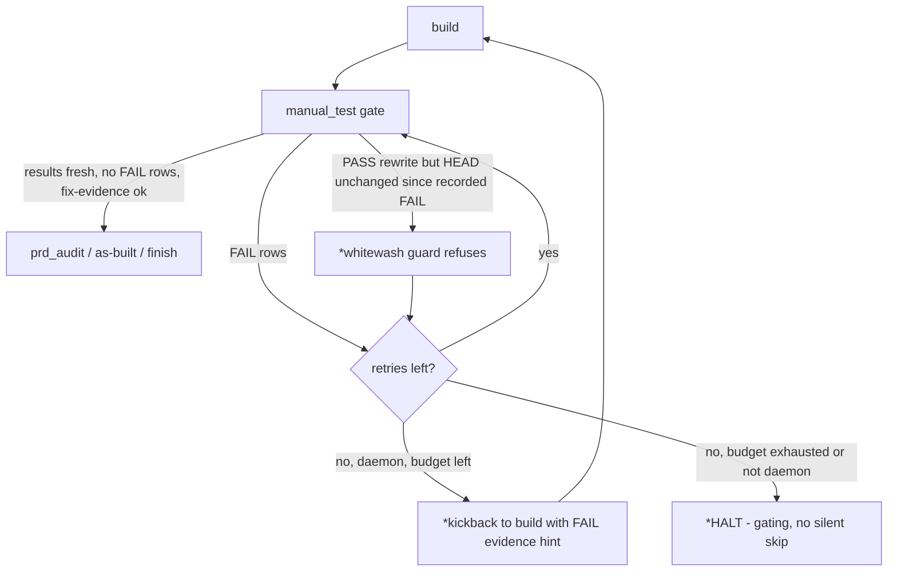
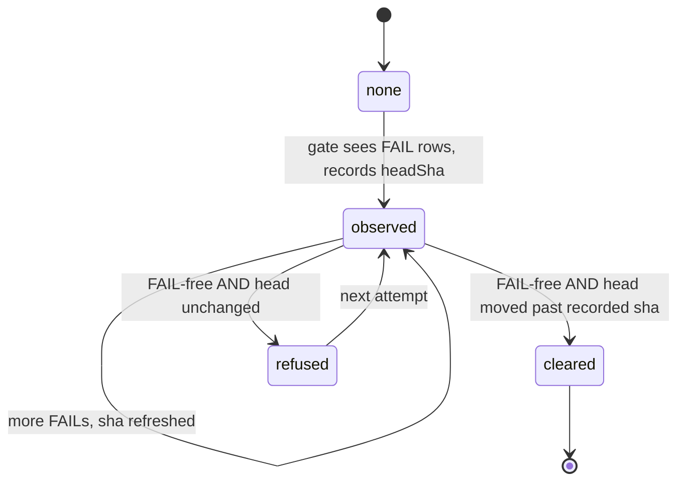

# Architecture: manual_test FAIL routing (ai-conductor#367)

Tail-loop routing after this change. New elements marked with `*`.

State machine of the fix-evidence marker (`.pipeline/manual-test-fail-evidence.json`):

