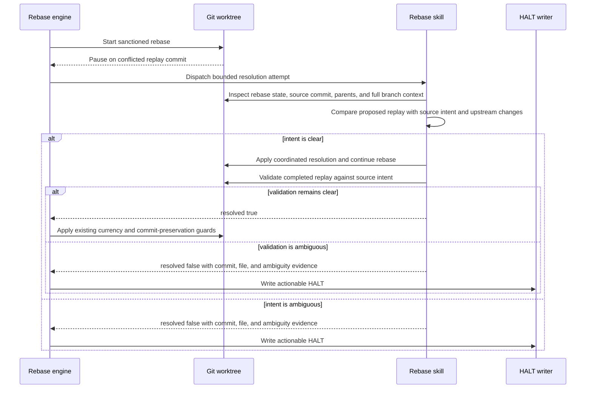

# Sequence: Rebase conflict resolution integrity

**Last updated:** 2026-08-01
**Scope:** Proposed bounded conflict-resolution attempt and its conservative acceptance boundary.

## Diagram

## Legend

- The rebase skill remains the judgment boundary and may make coordinated cross-file edits.
- The engine retains deterministic branch-currency and commit-preservation guards.
- Ambiguity is a terminal safety signal for the attempt, not permission to guess.

## Change Log

| Date | Change | Reason |
|---|---|---|
| 2026-08-01 | Confirmed staged and post-continue validation sequence | Plan update |
| 2026-08-01 | Added proposed integrity sequence | Specify #1152 before implementation |
