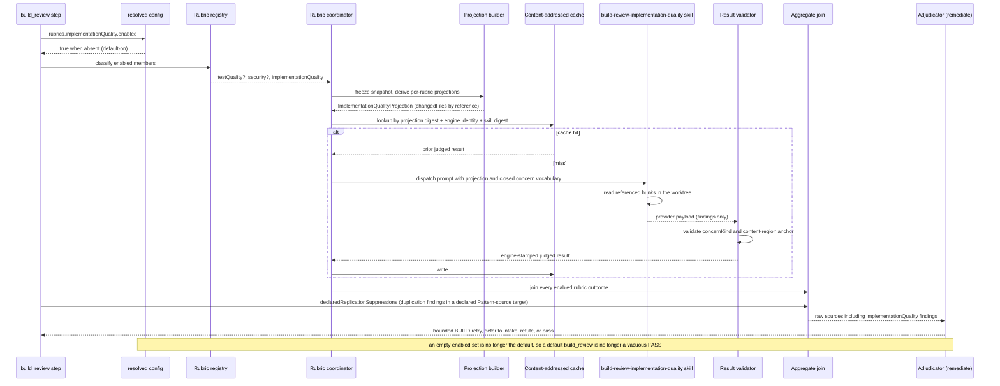
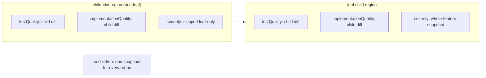

# Sequence: Implementation-quality rubric branch inside the build_review container

**Last updated:** 2026-10-09
**Scope:** One `build_review` lap with the new built-in `implementationQuality` rubric, which is enabled by
default. It shows how the third member joins the existing engine-managed fan-out beside `testQuality`
and `security`, and what its projection carries (the changed files only). It also shows where it is
placed under the per-child build region from #3050. It judges only the two questions no gate owns,
code quality and domain integrity. Acceptance criteria stay with `prd_audit`, and ADR conformance
stays with the as-built review (adr-2026-08-22-one-owner-per-review-question D1). It adds no new step,
event kind, or store. Retiring `/pipeline` batch evaluators is out of scope (#3056).

## Diagram: one lap

## Diagram: placement under the per-child build region (#3050)

## Legend

- **Rubric registry**: the closed built-in catalog. `implementationQuality` is the third entry, with its
  own `skillName`, projection version, output schema, and content-addressed cache policy.
- **ImplementationQualityProjection**: only the common fields (lap, digests, `mergeBase`, `headSha`,
  `changedFiles` by reference), like `SecurityProjection`. It carries no stories, plan, or ADRs,
  because the rubric judges none of the questions those artifacts own.
- **Closed concern vocabulary**: one `concernKind` per graded class. It covers duplication,
  complexity, readability, and domain-modelling defects (primitive obsession, representable invalid
  states, non-exhaustive domain matching, non-semantic naming). The CI vocabulary guard binds the skill text to the engine set in both directions.
- **Default-on**: an absent `rubrics.implementationQuality` block resolves to enabled.
  `enabled: false` opts out. The `testQuality` and `security` defaults are unchanged.
- **Declared-replication suppression**: after the join, the step runner uses the plan's resolved
  `Pattern-source:`/`Rename-map:` pair to record `implementationQuality` `duplication` findings
  that are anchored in the declared target and whose evidence names only the declared source. The
  effective verdict treats them as suppressed. This is engine bookkeeping; the projection never sees
  the plan (adr-2026-08-09-declared-pattern-replication-in-build D5, amended by #475).
- **Placement**: per child, like `testQuality`. Each child is graded on its own diff, so defects
  surface at the child that introduced them. Under the flat loop (no children), one snapshot serves every rubric.

## Change Log

| Date | Change | Reason |
|---|---|---|
| 2026-10-09 | Initial sequence and placement diagram for the implementation-quality rubric. | Third built-in rubric that takes over the pipeline evaluator's unowned review dimensions (#475); acceptance criteria excluded per the one-owner ADR. |
| 2026-10-09 | Added declared-replication suppression after the join. | Plan update after conflict-check resolution C3. |
