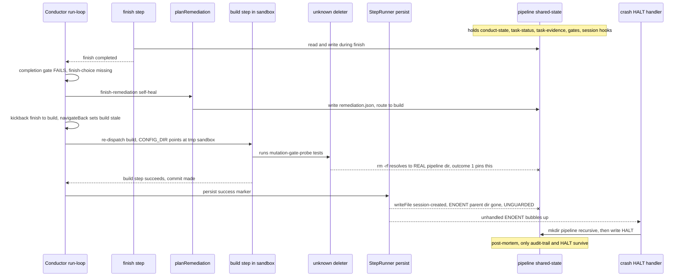
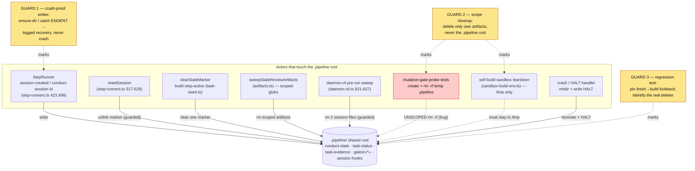

# Architecture: Mid-loop `.pipeline` wipe / kickback crash (ai-conductor#549)

**Last updated:** 2026-07-11
**Scope:** The finish→build kickback incident path and the `.pipeline` shared-state
boundary. This is a bug-fix diagram: it shows only the actors that touch `.pipeline`
during a step-kickback, where the crash lands, and the three guard points the fix adds.
It is not a full conductor map.

## Diagram 1 — Incident sequence (finish-failure → kickback → crash)

## Diagram 2 — `.pipeline` shared-state boundary + the three guard points

## Legend

- **Solid arrow** — a normal, scoped write/delete the actor is entitled to make.
- **Dashed red arrow (`TESTS`)** — the suspected out-of-scope `rm -rf` that reaches the
  real worktree `.pipeline` under host load; the leading root-cause candidate the
  regression test (Guard 3) must confirm and pin.
- **`--x` (sequence)** — a failed operation: the test's delete of live state, and the
  subsequent unguarded `session-created` write that throws ENOENT and crashes the loop.
- **GUARD 1 / 2 / 3** — the three fix zones. Guard 1 makes the crash impossible
  regardless of cause (writes/reads of `.pipeline` bookkeeping degrade to a logged
  recovery). Guard 2 scopes every kickback/teardown cleanup to its own artifacts. Guard
  3 is the root-cause regression test pinning the exact finish→build transition.
- **`«slug»` / `«*»`** — placeholder notation (guillemets) for variable path parts.
- Self-build only: the build step runs with `CLAUDE_CONFIG_DIR` redirected to a
  throwaway `/tmp` sandbox, so the build session's transcript is discarded on teardown —
  which is why the incident window has no forensic trail. The sandbox teardown itself is
  correctly `/tmp`-scoped and is shown only to explain the missing evidence.

## Change Log

| Date | Change | Reason |
|------|--------|--------|
| 2026-07-11 | Initial generation | DECIDE for ai-conductor#549 — depict the kickback crash path and the `.pipeline` shared-state guard points |
