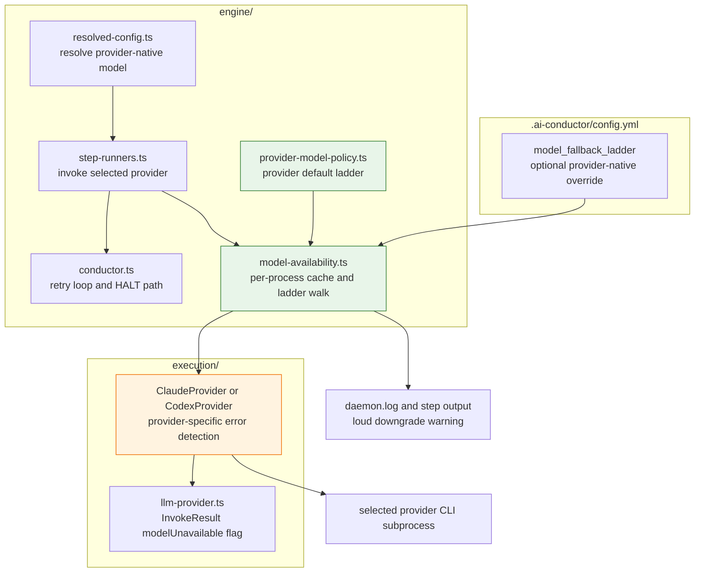
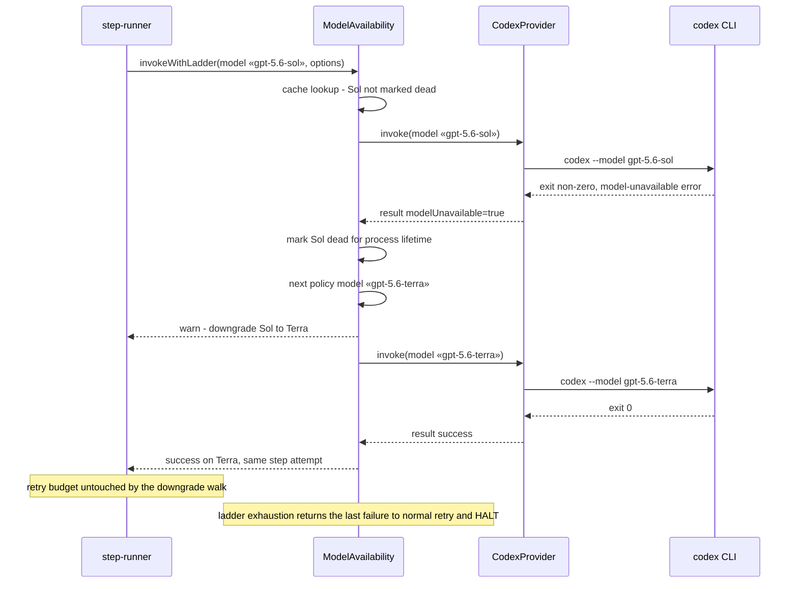

# Components + Sequence: Provider-Aware Model Availability Fallback

**Last updated:** 2026-07-23
**Scope:** Reactive model-unavailable detection in the selected provider and the
per-process provider-native fallback ladder that degrades invocations instead of
HALTing (issues #186 and #902).

## Component Diagram

## Sequence: Codex invocation with unavailable model

## Legend

- **Green** — provider policy and availability modules.
- **Orange** — provider-specific detection behind the unchanged invocation interface.
- The ladder walk happens inside one step attempt; downgrades never consume the
  step's `max_retries` budget.
- An explicit `model_fallback_ladder` remains an opaque provider-native override.
  Without it, Claude defaults to `fable → opus → sonnet` and Codex defaults to
  `gpt-5.6-sol → gpt-5.6-terra → gpt-5.6-luna`.
- Cache lifetime remains per process; restart clears it.

## Change Log

| Date | Change | Reason |
|------|--------|--------|
| 2026-07-03 | Initial generation | DECIDE phase for intake #186 |
| 2026-07-23 | Made the default ladder provider-native | DECIDE architecture for issue #902 |
