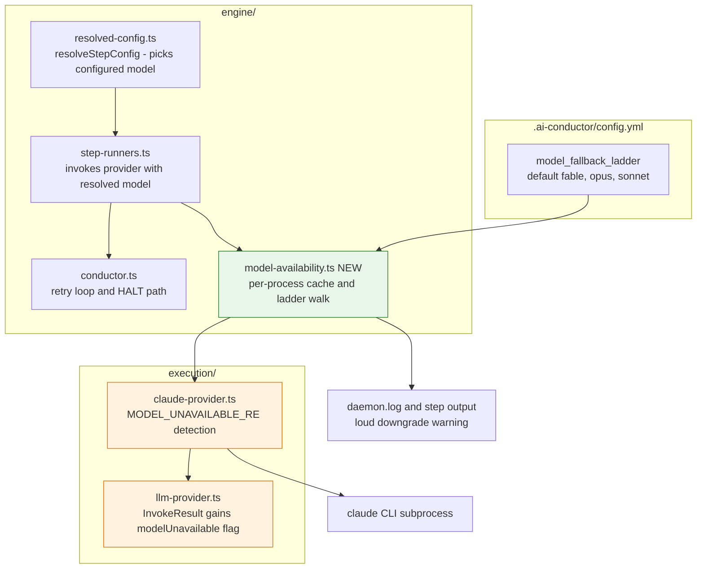
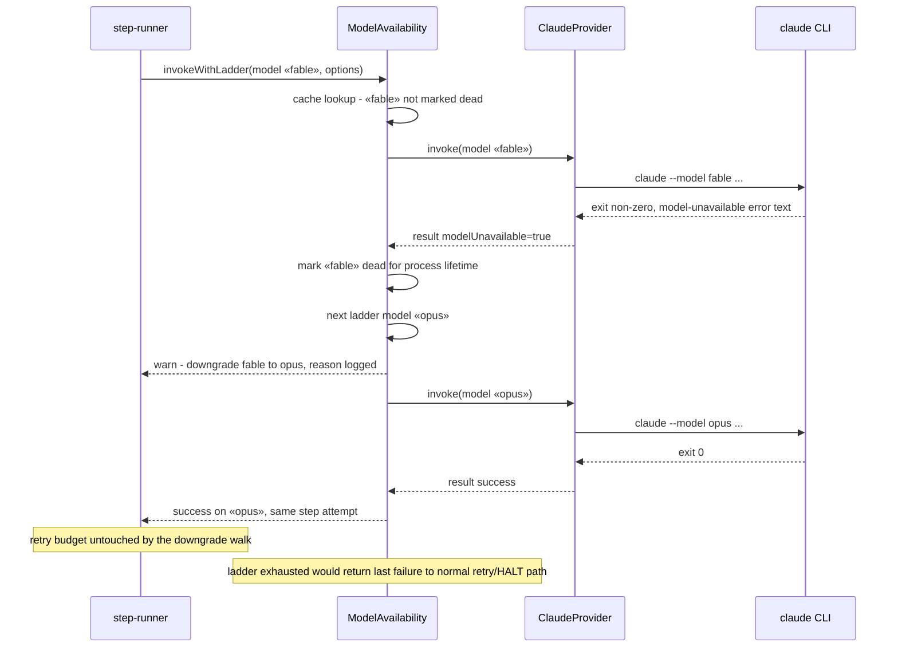

# Components + Sequence: Model Availability Fallback Ladder

**Last updated:** 2026-07-03
**Scope:** Reactive model-unavailable detection in ClaudeProvider and the per-process
fallback ladder that degrades invocations instead of HALTing (issue jstoup111/ai-conductor#186).

## Component Diagram

## Sequence: invocation with unavailable model

## Legend

- **Green** — new module (`model-availability.ts`).
- **Orange** — modified existing modules (detection flag threading).
- The ladder walk happens **inside one step attempt**: downgrades never consume
  the step's `max_retries` budget. Only a fully-exhausted ladder surfaces as a
  normal failure to the existing retry/HALT machinery.
- Cache is per-process (daemon or engineer CLI process); restart clears it.

## Change Log

| Date | Change | Reason |
|------|--------|--------|
| 2026-07-03 | Initial generation | DECIDE phase for intake #186 (engineer loop) |
