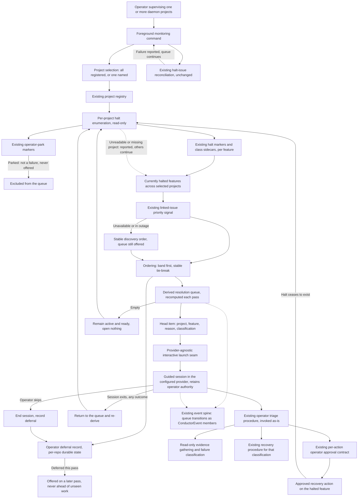

# Components: Monitor daemon HALTs through a guided resolution queue

**Last updated:** 2026-09-20
**Scope:** Proposed operator-facing monitoring loop for jstoup111/ai-conductor#1228; Large tier.
One new foreground operator command, one new provider-agnostic interactive launch seam, and new
spine members for queue transitions. No new service, no supervised process, no database, no change
to how halts are produced, classified, or recorded, and no change to the existing triage procedure
or its approval contract.

## Diagram

## Legend

- Boxes are responsibilities, not a requirement for one new file per box. Boxes labelled
  "existing" are reused unchanged; the genuinely new surfaces are the monitoring command, the
  interactive launch seam, the ordering step, and the deferral record.
- **The queue is derived, not stored.** Membership is recomputed from halt markers on every pass,
  which is why `Advance`, `Mutation` and `Idle` all loop back to `Scan` rather than mutating a
  queue object. A monitor holding no independent membership state cannot go stale when it dies —
  the answer to the objection recorded against this feature's ancestor in
  `adr-2026-07-10-observed-close-watch-registry` ("halt-monitor precedent: dies silently").
- **The deferral record is the one thing persisted**, because it is the one thing that cannot be
  recomputed: it is the operator's own decision, not an observable property of the halt. It is
  per-repo operator state and therefore belongs under the main root's daemon state directory,
  resolved through the existing main-root seam
  (`adr-2026-07-10-park-marker-main-root-resolution`), not spelled independently
  (`adr-2026-07-04-operator-park-marker` D6). That location is also live-boundary excluded, so
  writing it cannot halt a self-host build.
- Parked work is excluded rather than queued. A park is an operator directive, not a failure, and
  the existing triage signal table already classifies it that way.
- The dotted edge from `Scan` to `Members` is an error boundary, not a flow: one project that is
  unreadable, misconfigured, or missing is reported and the remaining projects are still monitored.
- **`Launcher` is the crux of the design.** Every session spawned through the provider adapters
  carries the daemon-session marker, and the entry guard then refuses every conductor verb except
  a small sanctioned worker set that deliberately excludes park, rewind, kickback-budget and
  status. A session launched that way could advise but never act, which would defeat FR-16. The
  seam therefore launches the configured provider outside that boundary — generalising the existing
  attached-session precedent, which spawns the provider binary directly with inherited stdio and
  today hardcodes one provider. Whether that exemption is the right resolution is OQ-1, settled at
  architecture-review; the diagram shows the shape the PRD's FR-16 requires, not a decided
  mechanism.
- Every session is a cold start. Neither provider can construct a resume invocation — the capability
  is structurally absent, not merely disabled — so the halt's context is rendered into the session's
  opening prompt (`adr-2026-07-27-cold-start-within-step-retries` §5).
- `Session` has no outbound observation edge. No dispatch may supply a stream consumer when the
  invocation is interactive (`adr-2026-08-25` D4, enforced at the attachment point), so the monitor
  learns the session's outcome from its exit alone — which is why exit is never read as
  "resolved". Resolution is re-derived from the halt marker on the next pass.
- `Advance` fires for every session outcome, including abandonment and error. The operator is always
  returned to the queue.
- The reconciliation edge is a cycle, not a dependency: it runs on the monitoring cycle with its
  behavior unchanged, and its failure is reported without stopping the queue.

## Event-Spine Decision

Channel? **Yes** — Step 1, first bullet: the design introduces a loop that observes state to learn
that something halted, and a durable deferral record read by a later pass.

Concern: **Both, and they separate cleanly.** Queue *membership* is durable state — it answers
"what is halted now", is read by name from the halt markers that already record it, and is exactly
what exception C describes; reconstructing it is re-reading state, not reconstructing occurrences.
The operator's deferral record is likewise durable state. Queue *transitions* — an item offered, a
session opened, an item deferred, a session ended — are occurrences in time that other components
need to know about, so they are bus concerns under Step 2.

Verdict: **Extend the union.** New `ConductorEvent` members carry the transitions, each with its
exhaustive sink declaration; the deferral record is a state artifact with its own schema, read by
name, and is not a second event-shaped ledger. This follows the committed-halt-record template
(`adr-2026-08-23-committed-halt-record` D8): the artifact is state, and the occurrences it generates
ride the existing spine. No sidecar log, no second reader path, no bespoke event format.

Exception: **C**, for the deferral record only. Exception B does not apply and is not claimed — no
write is being moved off an existing ledger.

**Open for architecture-review (OQ-3).** The skill's §6 worked example rejected an engine-side
watcher that polled artifact paths, because polling made the interval the timing floor and made a
renamed artifact read as "nothing happened". This design reads halt markers as state rather than
consuming halt events, on the ground that marker presence is the same signal the daemon's own
dispatch gate uses and is therefore the authority on what is halted. The counter-argument is real
and must be weighed rather than assumed away: halt events are persisted and could drive detection.
It is weakened by the fact that `halt_cleared` is declared `persist: false` and so never reaches the
persisted ledger, and that no positive halt-raised event exists — the universal choke point is a
dependency callback inside the daemon process, not an event — so an event-driven monitor would
today both miss halts and continue offering resolved ones. Architecture-review settles this and
records it as an ADR.

## Change Log

| Date | Change | Reason |
|------|--------|--------|
| 2026-09-20 | Initial generation | Authored during DECIDE for jstoup111/ai-conductor#1228 |
